- [1. Denetimsiz Öğrenme Nedir?](#1-denetimsiz-öğrenme-nedir)
- [2. Optimum Küme Sayısının
  Seçilmesi](#2-optimum-küme-sayısının-seçilmesi)
  - [2.1. Dirsek Yöntemi](#21-dirsek-yöntemi)
  - [2.2. Ortalama Silhouette Yöntemi](#22-ortalama-silhouette-yöntemi)
  - [2.3. Gap İstatistiği](#23-gap-i̇statistiği)
  - [2.4. Calinski-Harabasz Yöntemi](#24-calinski-harabasz-yöntemi)
  - [2.5. Davies-Bouldin Yöntemi](#25-davies-bouldin-yöntemi)
  - [2.6. Dunn Endeksi](#26-dunn-endeksi)
- [3. k-ortalamalar](#3-k-ortalamalar)
  - [3.1. Kümelemede Veri Önişleme](#31-kümelemede-veri-önişleme)
  - [3.2. R’da k-ortalamalar
    Uygulaması](#32-rda-k-ortalamalar-uygulaması)
- [4. k-medoidler](#4-k-medoidler)
  - [4.1. R’da k-medoidler](#41-rda-k-medoidler)
- [5. Hiyerarşik Kümeleme](#5-hiyerarşik-kümeleme)
  - [5.1. Kojenetik Mesafe](#51-kojenetik-mesafe)
    - [5.1.1. R’de Kojenetik Mesafe](#511-rde-kojenetik-mesafe)
  - [5.2. R’da Ward’ın Minimum Varyans
    Bağlantısı](#52-rda-wardın-minimum-varyans-bağlantısı)
  - [5.3. R’da Ortalama Bağlantı
    Yöntemi](#53-rda-ortalama-bağlantı-yöntemi)
- [6. Yoğunluk Bazlı Kümeleme](#6-yoğunluk-bazlı-kümeleme)
  - [6.1. R’da Yoğunluk Bazlı Kümeleme](#61-rda-yoğunluk-bazlı-kümeleme)
- [7. Küme Geçerliliği](#7-küme-geçerliliği)
  - [7.1. Connectivity](#71-connectivity)
    - [7.1.1. R’da Connectivity](#711-rda-connectivity)
  - [7.2. Düzeltilmiş Rand Indeksi](#72-düzeltilmiş-rand-indeksi)
    - [7.2.1. R’da Düzeltilmiş Rand
      Indeksi](#721-rda-düzeltilmiş-rand-indeksi)
  - [7.3. Meila’s Variation of
    Information](#73-meilas-variation-of-information)
    - [7.3.1. R’da Meila’s Variation of
      Information](#731-rda-meilas-variation-of-information)
  - [7.4. R’da Küme Geçerliği İçin
    Silhouette](#74-rda-küme-geçerliği-i̇çin-silhouette)
  - [7.5. Dunn Indeksi](#75-dunn-indeksi)
- [8. Temel Bileşen Analizi](#8-temel-bileşen-analizi)
  - [8.1. R’da Temel Bileşenler
    Analizi](#81-rda-temel-bileşenler-analizi)
- [Alıştırmalar](#alıştırmalar)

# 1. Denetimsiz Öğrenme Nedir?

Metinlerin, görüntülerin, sayıların ve daha fazlasının çılgınca bir
araya geldiği sonsuz veri akışlarından oluşan bir denizde gezindiğinizi
hayal edin. Dijital çağın bu zengin kaynağı derinlerde saklı gerçek bir
değer taşır. Bunu yüzdeyden fark etmek çok mümkün değildir. Denetimli
makine öğrenimi yaklaşımları makinenin eğitimi için etiketli verileri
kullanır ve bu, hiç bilmediğiniz sonsuz veri akışına sahip o denizde bir
harita ile gezinmeye benzer. Gideceğiniz yeri bilirsiniz ve rotanız
açıkça işaretlenmiştir. Bu şekilde yol almak oldukça basittir, değil mi?
Peki ya size herhangi bir açıklama verilmeden, işaret veya ipucu olmadan
bu seyehati yapsaydınız? İşte bu noktada denetimsiz öğrenme devreye
giriyor.

Denetimsiz öğrenme, veri dünyasında saklı olan sırları keşfetme
sanatıdır. Makinelerin ne arayacaklarını bilmeden verilerin
derinliklerine dalmalarını sağlayan bir dizi teknik içerir. Etiketli
örnekler tarafından yönlendirilmek yerine, denetimsiz öğrenme
algoritmaları altta yatan yapıları, ilişkileri ve desenleri ortaya
çıkarmak için veri okyanusunun derinliklerine dalar. Bu, bir makineye
bir büyüteç vermek ve kendi kalıplarını ve bağlantılarını keşfetmesine
izin vermek gibidir.

Denetimsiz öğrenmenin merkezinde iki ana konu bulunmaktadır: kümeleme ve
boyut indirgeme. Kümeleme, bir veri setinde bulunan gözlemleri
benzerliklerine göre gruplara ayırma işlemidir. Eve yeni bir kitaplık
aldığınızı hayal edin. Önceden çalışma masanızın üzerine, evdeki
sehpalara yığmanız gereken kitapları, şimdi, yeni aldığınız kitaplığa
yerleştirebilirsiniz. Fakat kitapların her birinin hangi rafta olacağını
ve hatta raftaki sıralamasını nasıl belirlerdiniz? Örneğim Asimov,
Philip Dick ve Frank Herbert’in kitaplarına ek olarak James Joyce,
Tolstoy ve Albert Camus gibi yazarlara ait kitaplarınız da var. Bu
kitaplar arasındaki benzerlik nedir? Asimov ve Herbert gibi yazarlar
bilim-kurgu temalı kitaplar kaleme aldıkları için bir benzerlikleri
olduğunu söyleyebiliriz. Fakat diğer taraftan Joyce ve Camus gibi
yazarları ise dünya klasikleri çatısı altında birleştirebiliriz. Yani
temelde iki küme oluşturmuş oluruz; dünya klasikleri ve bilim-kurgu
kitapları. Yani kitaplığımızda bulunan kitapları kümelemiş oluruz.
Örneğini vermiş olduğum bu teknik, yani kümemele, pazarlamada müşteri
segmentasyonundan sağlık hizmetlerinde hastalık alt tiplerinin
belirlenmesine kadar çeşitli alanlarda son derece kullanışlıdır.

Boyut indirgeme, özelliklerin veya boyutların sayısını azaltarak
karmaşık verileri basitleştirmekle ilgilidir. Ayrıntılı bir resim
düşünün; boyut indirgeme orijinalin özünü koruyan daha basit, soyut bir
temsil oluşturmaya yardımcı olur. Unutulmamalıdır ki makinelerle
yaptığımız her işlemin arka planda makineye bir maliyeti vardır. Tıpkı
iş yerinde size verilen bir görev, ya da okulda yapmanız gereken bir
ödev gibi. Bu tarz görevlerin yerine getirilmesi için vakit, emek ve
belki çok daha fazlasını harcamanız gerekir. Ancak size verilen görev ne
kadar basitse, yapacağınız harcamalar da aynı nicelikte azalacaktır.
Boyut indirgeme de tam olarak bunu yapmaktadır. Boyutunu indirgediğimiz
bir veri seti, makinenin daha az yorulmasına ve maliyetinin azalmasına
olanak sağlayacaktır. Üstelik tek artısının bu olduğunu da söyleyemeyiz.
Bu kitaba ulaşabilen bir çoğunuzun da bilebileceği gibi veri setlerinin
görselleştirilmesi üç boyutla sınırlıdır. Üçüncü boyut, yani bir başka
deyişle üç değişkenli, veri setleri dışında, daha fazla değişkene sahip
veri setlerini görselleştirmek mümkün değildir. Fakat örneğin on beş
değişkenli bir setinin boyutunu iki değişkene düşürürsek, sizin de
tahmin edebileceğimiz gibi veri seti görselleştirilebilir bir hale
gelecektir. Tüm bunlar hesaba katıldığında ise boyut indirgemenin bizi
boyutu büyük bir lanetten kurtaran, tonton algoritma büyücüsü olduğunu
söyleyebiliriz.

Bu kitabın kalan kısmında çeşitli kümeleme algoritmalarıyla birlikte
boyut indirgeme tekniklerinden Temel Bileşen Analizinin nasıl
çalıştığını, adım adım nasıl hesaplandığını ve R’da nasıl uygulanacağını
göreceğiz. Ayrıca kitabın en sonunda yer alan Alıştırma bölümüyle
öğrendiklerinizi sınayabilir, hatta pekiştirebilirsiniz. Unutmayın ki
makine öğrenmesi bir buz dağı ise öğretmek görünen, öğrenmek ise buz
dağının görünmeyen kısmıdır. Eğer birçok veri seti ile öğrendiğiniz
şeyleri tekrar tekrar denemezseniz aslında hiçbir şey öğrenmemiş
olacaksınız. Tüm bunlar düşünüldüğünde umarım bu kitap sizin için
faydalı olacaktır.

# 2. Optimum Küme Sayısının Seçilmesi

Böyle bir başlıkla karşılaştığınızda küme sayısının belirlenmesinin
neden önemli olduğunu merak edebilirsiniz. Bir önceki bölümdeki kitaplık
örneğini hatırlayalım. Kitaplıkta yer alan kitapları iki kümeye(dünya
klasikleri ve bilim-kurgu kitapları) ayırmıştık. Fakat iki küme olduğuna
nasıl karar verdik? Gerçekten iki kümenin doğru küme sayısı olduğundan
emin olabilir miyiz? Hatta çrnekte elimizde yalnızca altı kitap olduğu
için bunu bir şekilde yapabildik. Ya elimizdeki kitap sayısı bir milyon
olsaydı? Küme sayısını belirlemek bazı durumlarda mümkün olabilirken,
bazen de bir o kadar mümkün olmayabilir. Bunu bir veri seti ile
gözününzde canlandırmak faydalı olabilir. Örneğin aşağıdaki dağılım
grafiğine baktığımızda küme sayısının üç olduğunu, gözlemlerin üç farklı
nokta özelinde yoğunlaşması sebebiyle söyleyebiliriz.


Ancak, yaygın olarak karşılaşılan veri setlerinde küme sayısını
belirlemek, sadece bir dağılım grafiği ile veri setinin genel yapısını
gözlemleyerek elde edilemeyecek kadar karmaşıktır. Örneğin aşağıdaki
dağılım grafiği incelendiğinde veri setinin kaç kümeye ayrıldığını
söylemek oldukça zor olacaktır.


Bu gibi sorunlarla sürekli karşılaşıldığı için, küme sayısını belirleme
göreviyle bazı yöntemler geliştirilmiştir. Bu bölümün kalanında bu
yöntemlerden en çok kullanılan altı tanesinin ne olduğunu, adım adım
nasıl hesaplandıklarını ve R’da nasıl uygulandıklarını göreceğiz. Tüm
örneklerde aynı veri seti ([Breast Cancer
Wisconsin](https://archive.ics.uci.edu/ml/datasets/breast+cancer+wisconsin+%28diagnostic%29))
kullanılmıştır..

## 2.1. Dirsek Yöntemi

Dirsek yöntemi, bir kümeleme analizinde en uygun küme sayısını
belirlemek için kullanılan bir tekniktir. Arkasındaki fikir, bir dizi
küme sayısı (k) için veri kümesi üzerinde k-ortalamalar kümelemesini
çalıştırmak ve her k değeri için her noktanın en yakın merkeze olan
karesel uzaklıklarının toplamını (KUT) hesaplamaktır. Dirsek noktası,
KUT’nin k’ya karşı grafiğinde KUT’daki değişimin düzleşmeye başladığı
noktadır, bu da daha fazla küme eklemenin modeli çok fazla
iyileştirmediğini gösterir. \[1\], \[2\]

Dirsek yöntemini aşağıdaki adımlarla hesaplanabilir:

1.  Genellikle 1 ila 10 arasında seçilen ama analize göre değişebilecek
    aralıkta küme sayıları belirlenir.

2.  Her k değeri için istediğinilen kümeleme algoritmasını çalıştırılır
    ve her bir k değeri için KUT hesaplanır.

3.  Her k değeri x ekseninde, KUT değerleri ise y ekseninde olacak
    şekilde çizgi grafiği çizilir.

4.  KUT’un daha yavaş bir oranda azalmaya başladığı nokta dirsek
    noktasıdır ve buna karşılık gelen küme sayısı k için en uygun
    değerdir.

Kuşkusuz, Dirsek yöntemi en yaygın kullanılan yöntemlerden biridir.
Ancak, tecrübeyle sabit, her koşulda iyi sonuçlar verdiğini söylemek
yanlış olacaktır. Hatta bazen yanıltıcı olduğu bile söylenebilir. Bu
nedenle her kümeleme analizinde küme sayısını belirlemek için Dirsek
Yönteminin kullanılması gerektiği; ancak tek başına bu yönteme
güvenilmemesi gerektiğinin altı mutlaka çizilmelidir.

R’da `factoextra` paketi optimum küme sayısını belirleme yöntemleri için
güzel grafik imkanları sunan güzel bir paket. Biz de bu pakette yer alan
`fviz_nbclust` fonksiyonu ile Dirsek Grafiğini çizeceğiz.

``` r
fviz_nbclust(df, # veri seti  
             kmeans, # kümeleme algoritması 
             nstart = 25, # kümeleme algoritması ile ilgili seçenek 1
             iter.max = 200, #  kümeleme algoritması ile ilgili seçenek 2 - bu iki seçenek k-means bölümünde açıklanacaktır.
             method = "wss") # dirsek yöntemi için wss yazılmalıdır.
```

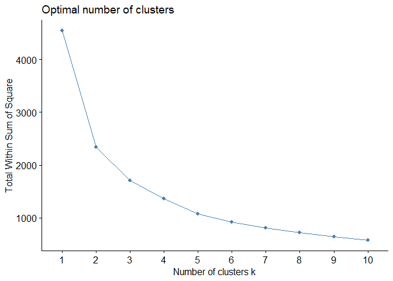<!-- -->

Örneğin yukarıdaki çıktıda keskin bir dirsek olmadığı görülmektedir. Bu
nedenle yoruma açık bir sonuç olarak dikkat çekmektedir. Bu dirseğe
dayalı bir yorum bu nedenle yanlış sonuçlara yol açabilir.

## 2.2. Ortalama Silhouette Yöntemi

Ortalama silhouette yöntemi, belirli bir gözlemin dahil olduğu kümeyi ne
kadar iyi tanımlandığını ve diğer kümelerden ne kadar iyi ayrıldığını
ölçen bir geçerlilik metriğidir \[3\] , \[4\]. Üç adımda
hesaplanmaktadır.

1.  Küme sıkılığı hesaplanır: silhouette katsayısı hesaplanan
    gözlemin(aşağıdaki çizimde mor renkle vurgulanan gözlem) dahil
    olduğu kümenin diğer elemanlarına(mavi renkle vurgulanan diğer bütün
    gözlemler) uzaklıklarının toplamının toplam gözlem sayısına
    bölünmesi. Bu metriği a(i) olarak isimlendirebiliriz. (Uzaklık
    hesaplanırken genellikle Öklit uzaklık metriği tercih edilir.)

    

2.  Küme ayrımı hesaplanır: silhouette katsayısı hesaplanan gözlemin
    dahil olmadığı kümelerde yer alan gözlemler içerisinden uzaklığı en
    az olan gözlemle olan uzaklığı. Bu metriği b(i) olarak
    isimlendirebiliriz.

    

3.  Silhouette katsayısı hesaplanır: b(i) değerinin a(i) değerinden
    farkının alınıp; b(i) ve a(i) değerlerinden hangisi daha yüksek bir
    değere sahipse o değere bölünmesi ile silhouette katsayısı bulunur.


Yukarıdaki adımlarla veri setinde yer alan her bir gözlem için
Silhouette değeri hesaplanır. Eğer her bir gözlemin Silhouette
katsayısına bakarsak her bir gözlem için kümelemenin ne kadar başarılı
olduğunu görebiliriz. -1 ile 1 arasında değer alan Silhouette
katsayısında, bir değer 1’e ne kadar yakında kümeleme sonucunun o kadar
başarılı olduğunu söyleyebiliriz. Fakat bizim buradaki önceliğimizin
küme sayısı belirlemek olduğunu hatırlayalım. Tüm gözlemlerin silhouette
değerlerini toplayıp veri setindeki gözlem sayısına bölersek kümeleme
sonucunun Silhouette değerine ulaşmış oluruz. Fakat yine, bu bölümdeki
önceliğimizle çelişen bir sonuç elde etmiş olduk. Küme sayısını
belirlemek için belirli aralıkta(örneğin 2 ile 10 arasında) her bir
sayıda küme için kümeleme yapılıp, her bir kümelemenin silhouette
değerini hesaplayıp en yüksek değeri ararsak bu sefer Silhouette
yöntemini küme sayısı belirlemek için kullanmış oluruz.

Yine `fviz_nbclust` fonksiyonu optimum küme sayısına karar vermek için
ortalama silhoutte grafiğini görmenin bir yoludur:

``` r
fviz_nbclust(df, # veri
             kmeans, # kümeleme algoritması
             method = "silhouette") # silhouette grafiği için 
```

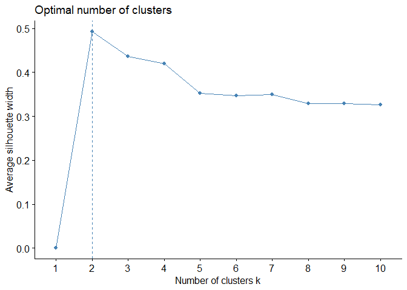<!-- -->

Grafikten kolayca görülebileceği gibi, en yüksek silhouette değerine
sahip kümeleme modeli 2 küme için kümelemedir. Dolayısıyla optimum küme
sayısının iki olduğu sonucuna varılabilir. Ancak, y eksenindeki
silhouette değerleri incelendiğinde, 2 küme sayısı en yüksek olmasına
rağmen 3 küme sayısının silhouette değeri de oldukça yakındır. Bu
nedenle kümeleme algoritmasının hem 2 hem de 3 küme için çalıştırılması
ve sonuçların yorumlanması daha faydalı olacaktır. Tıpkı Dirsek
Yönteminde olduğu gibi, Ortalama Silhouette yöntemine de tek başına
güvenilmemelidir. Veri setini 2 ve 3 küme sayısı için kümeleyip;
kümelerin genel yapısını analiz etmek her yöntemden daha güvenilir
olacaktır.

## 2.3. Gap İstatistiği

farklı k değerleri için gözlemlenen küme içi varyansı, verilerin boş bir
referans dağılımı altında beklenen varyansla karşılaştırarak küme
geçerliliğini ölçen bir metriktir ve altı farklı adımla hesaplanır.
\[5\]

1.  Genellikle 2 ila 10 arasında bir k değeri aralığı seçilir.

2.  Her k değeri için arzu edilen kümeleme algoritmasıyla veri seti
    kümelenir ve küme içi varyans hesaplanır.

3.  Orijinal veriler rassal örneklenerek referans kümeler oluşturulur ve
    oluşturulan her kümenin küme içi varyansı hesaplanır.

4.  Gerçek kümelerin küme içi varyansı ile ve referans kümelerin küme
    içi varyansları birbirinin farkı alınarak Gap İstatistik değeri elde
    edilir.

5.  Her k değeri için ayrı ayrı Gap İstatistik değeri hesaplanır.

6.  Maksimum Gap İstatistiğine karşılık gelen k değeri optimum küme
    sayısıdır.

Tıpkı diğer yöntemlerde olduğu gibi `fviz_nbclust` fonksiyonu kullanarak
Gap İstatistik methodunun çizgi grafiğini çizdirebiliriz:

``` r
fviz_nbclust(df, 
             kmeans ,
             nstart = 25, 
             method = "gap_stat")
```

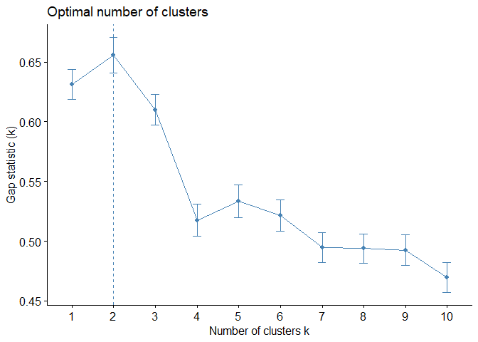<!-- -->

Ortalama Siluet Yöntemi gibi Gap İstatistiği Yöntemi de optimum küme
sayısı olarak 2’yi önermektedir.

## 2.4. Calinski-Harabasz Yöntemi

Varyans Oranı Kriteri olarak da bilinen Calinski-Harabasz, tıpkı diğer
yöntemler gibi, küme geçerliliği ve küme sayı belirlemede kullanılır.
Kümeler arası varyans ile küme içi varyansın bir oranı olarak da
açıklanabilecek yöntem üç farklı adımda hesaplanır\[6\].

1.  Her bir küme için, o kümede bulunan bütün gözlemlerin küme merkezine
    olan uzaklıklarının ortalaması hesaplanır. WCSS olarak da
    adlandırılabilir

    

2.  Her bir küme için o kümenin merkezinin veri setinin merkezine olan
    uzaklığı hesaplanır. BCSS olarak adlandırabiliriz.

    

3.  Aşağıdaki formül kullanılarak her bir küme için Calinski-Harabasz
    katsayısı hesaplanır.

(BCSS / WCSS) — (n-k) / (k-1)

\*burada k toplam küme sayısını, n ise veri setindeki toplam gözlem
sayısını ifade eder.

Calinski-Harabasz indeksi 0 ile sonsuz arasında değerler alır ve daha
yüksek bir değer daha iyi bir kümelemeye işaret eder. Calinski -
Harabasz yöntemi için R’da daha önce bahsettiğim yöntemlerde olduğu gibi
bir görselleştirme fonksiyonu bulunmamaktadır. Bu nedenle, `fpc`
paketindeki `calinhara` fonksiyonunu kullanarak 2 ila 10 arasındaki
kümeler için Calinski - Harabasz değerlerini hesaplayan ve
görselleştiren bir fonksiyon yazalım.

``` r
library(fpc) # calinhara fonksiyonu için kütüphanenin çağırılması

fviz_ch <- function(data) { # fonksiyonun oluşturulması: tek girdisi veri seti
  ch <- c()
  for (i in 2:10) { # 2 ile 10 küme sayısı için bir döngü
    km <- kmeans(data, i) # kümelemenin uygulanması
    ch[i] <- calinhara(data, # veri seti
                       km$cluster, # kümeleme atamaları
                       cn=max(km$cluster) # toplam küme sayısı
                       ) # döngüdeki küme sayısı için calinski-harabasz değerinin hesaplanması
  }
  ch <-ch[2:10] # hesaplanan ch değerlerinin bir nesnede toplanması
  k <- 2:10 
  plot(k, ch,xlab =  "Cluster number k",
       ylab = "Caliński - Harabasz Score",
       main = "Caliński - Harabasz Plot", cex.main=1,
       col = "dodgerblue1", cex = 0.9 ,
       lty=1 , type="o" , lwd=1, pch=4,
       bty = "l",
       las = 1, cex.axis = 0.8, tcl  = -0.2) # çizgi grafiği
  abline(v=which(ch==max(ch)) + 1, lwd=1, col="red", lty="dashed") # maksimum değeri işaret edecek dikey kesikli çizgi
}

fviz_ch(df) # grafiğin çizdirilmesi
```

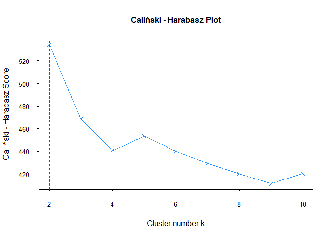<!-- -->

Tıpkı diğer yöntemler gibi Calinski - Harabasz da 2 küme önermektedir.

## 2.5. Davies-Bouldin Yöntemi

Davies-Bouldin kümeler arasındaki benzerliği ölçen bir küme geçerliliği
ve küme sayısı belirleme metriğidir\[7\]. Üç ana adımda aşağıdaki gibi
hesaplanır:

1.  Her bir küme için, o kümede bulunan bütün gözlemlerin küme merkezine
    olan uzaklıklarının ortalaması hesaplanır.

    

2.  Her bir kümenin merkezinin diğer kümelerin merkezine olan uzaklığı
    hesaplanır.

    

3.  Her bir kümenin kendisine en benzer olan, yani merkezler arasındaki
    mesafesi minimum olan değer bulunur. Bu iki kümenin birinci adımda
    hesaplanan değerlerinin toplamı bu iki kümenin merkezi arasındaki
    mesafeye bölünür. Böylelikle her bir küme için en benzer küme
    bulunmuş olur. Ardından bütün kümelerin bu değerleri toplanıp küme
    sayısına bölünerek o kümelemenin Davies-Bouldin katsayısı
    hesaplanmış olur.

Davies-Bouldin indeksi 0 ile sonsuz arasında değerler alır ve daha düşük
bir değer daha iyi bir kümelemeye işaret eder. Bu değerin 0 olması
herhangi iki küme arasında benzerlik olmadığını gösterirken; yüksek
olması bazı kümeler arasında yüksek düzeyde benzerlik olduğunu gösterir.

Tıpkı Calinski-Harabasz yönteminde olduğu gibi Davies-Bouldin yöntemi
için de R’da bir görselleştirme fonksiyonu bulunmamaktadır. Bu nedenle,
`NbClust` paketindeki `NbClust` fonksiyonunu kullanarak 2 ila 10
arasındaki kümeler için Davies Bouldin değerini hesaplayan ve
görselleştiren bir fonksiyon yazalım.

``` r
library(NbClust)

fviz_db <- function(data) {
  k <- c(2:10)
  nb <- NbClust(data, min.nc = 2, max.nc = 10, index = "db", method = "kmeans")
  db <- as.vector(nb$All.index)
  plot(k, db,xlab =  "Cluster number k",
       ylab = "Davies-Bouldin Score",
       main = "Davies-Bouldin Plot", cex.main=1,
       col = "dodgerblue1", cex = 0.9 ,
       lty=1 , type="o" , lwd=1, pch=4,
       bty = "l",
       las = 1, cex.axis = 0.8, tcl  = -0.2)
  abline(v=which(db==min(db)) + 1, lwd=1, col="red", lty="dashed")
}

fviz_db(df)
```

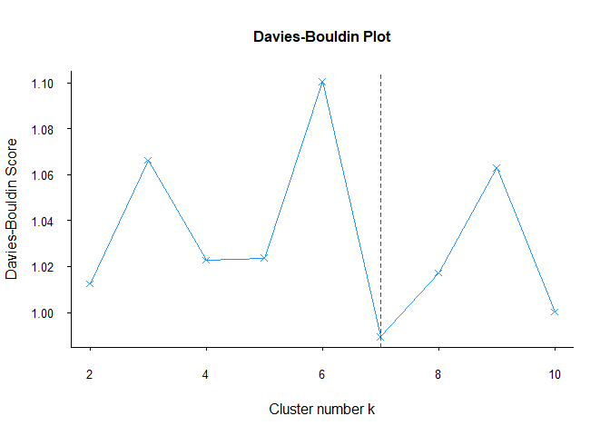<!-- -->

Diğer yöntemlerden farklı olarak Davies-Bouldin’in küme sayısı için
önerisinin 7 olduğunu görüyoruz. Bu veri setinde farklı sonuçlar verse
de diğer veri setlerinde daha güvenilir sonuçlar verebilir. Bu nedenle
her kümeleme analizinde Davies-Bouldin yöntemine yer verilmesi faydalı
olacaktır.

## 2.6. Dunn Endeksi

Dunn indeksi, bir kümeleme analizindekikümelerin kompaktlığının ve
ayrımının bir ölçüsüdür \[8\] ve aşağıdaki üç adımla hesaplanır:

1.  İki farklı kümeye ait olan gözlemlerin birbiri arasındaki farklar
    hesaplanarak farklı kümelerde olup birbirine en yakın olan gözlem
    hesaplanır. Buna minimum ayrışma adı verilir.

    

2.  Aynı kümede yer alan gözlemler arasındaki mesafe hesaplanarak
    birbirine en uzak iki gözlemin arasındaki mesafe hesaplanır ve buna
    maksimum dağılım adı verilir.

    

3.  Minimum ayrışma maksimum dağılıma bölünerek Dunn Endeksi hesaplanır.

Dunn indeksi 0 ile sonsuz arasında değerler alır ve daha yüksek bir
değer daha iyi bir kümelemeye işaret eder. 1 değeri, kümelerin mükemmel
bir şekilde ayrıldığını ve mükemmel bir şekilde kompakt olduğunu
gösterirken, düşük bir değer kümelerin ayrılmadığını veya kompakt
olmadığını gösterir.

Tıpkı Calinski-Harabasz ve Davies- Bouldin yöntemlerinde olduğu gibi
Dunn Index için de R’da görselleştirme fonksiyonu bulunmamaktadır. Bu
nedenle, `clValid` paketindeki `dunn` fonksiyonunu kullanarak 2’den 10’a
kadar olan kümeler için Dunn Index değerlerini hesaplayan ve
görselleştiren bir fonksiyon yazalım.

``` r
library(clValid)
```

    ## Zorunlu paket yükleniyor: cluster

``` r
fviz_dunn <- function(data) {
  k <- c(2:10)
  dunnin <- c()
  for (i in 2:10) {
    dunnin[i] <- dunn(distance = dist(data), clusters = kmeans(data, i)$cluster)
  }
  dunnin <- dunnin[2:10]
  plot(k, dunnin, xlab =  "Cluster number k",
       ylab = "Dunn Index",
       main = "Dunn Plot", cex.main=1,
       col = "dodgerblue1", cex = 0.9 ,
       lty=1 , type="o" , lwd=1, pch=4,
       bty = "l",
       las = 1, cex.axis = 0.8, tcl  = -0.2)
  abline(v=which(dunnin==max(dunnin)) + 1, lwd=1, col="red", lty="dashed")
}

fviz_dunn(df)
```

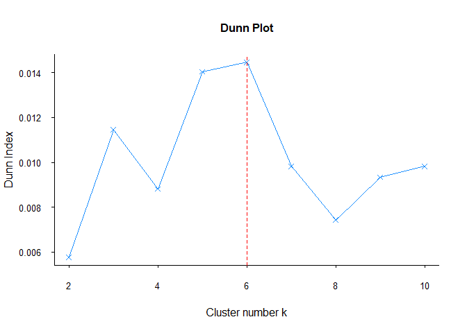<!-- -->

Davies-Bouldin yöntemleri gibi Dunn da farklı küme sayıları önermiştir.
Daha önce de söylediğim gibi, her yöntem her veri seti için farklı
sonuçlar verebilir. Bu nedenle her kümeleme analizinde tüm yöntemlerin
karşılaştırılmasında fayda vardır.

***References for Chapter***

\[1\] Steinley, D., & Brusco, M. J. (2011). Choosing number of clusters
in Κ-means clustering. Psychological methods, 16(3), 285.

\[2\] Halkidi, Maria, Yannis Batistakis, and Michalis Vazirgiannis. “On
clustering validation techniques.” Journal of intelligent information
systems 17 (2001): 107–145.

\[3\] RouKUTeuw, Peter J. Silhouettes: a graphical aid to interpretation
and validation of cluster analysis.Journal of computational and applied
mathematics, 1987, 20: 53–65.

\[4\] Halkidi, M., Batistakis, Y., & Vazirgiannis, M. (2001). On
clustering validation techniques. Journal of intelligent information
systems, 17, 107–145.

\[5\] Tibshirani, R., Walther, G., & Hastie, T. (2001). Estimating
number of clusters in a data set via gap statistic. Journal of Royal
Statistical Society: Series B (Statistical Methodology), 63(2), 411–423.

\[6\] Caliński, T., & Harabasz, J. (1974). A dendrite method for cluster
analysis. Communications in Statistics-theory and Methods, 3(1), 1–27.

\[7\] Davies, D. L., & Bouldin, D. W. (1979). A cluster separation
measure. IEEE transactions on pattern analysis and machine intelligence,
(2), 224–227.

\[8\] Dunn, J. C. (1973). A fuzzy relative of ISODATA process and its
use in detecting compact well-separated clusters.

# 3. k-ortalamalar

Herhangi bir kümeleme analizi sonrasında ortaya çıkacak kümeler
genellikle birden çok gözlem içerir. Çoklu sayıdaki bu gözlemlerin
birleşimi kümeleri oluşturur. Kümeleme algoritmalarının bu kümeleri
algılayabilmesi için kümelerin temsil edilmesi gerekmektedir. Genellikle
her bir kümeyi temsil eden noktaya küme merkezi(centroid) deriz.
k-ortalamalar kümeleme algoritması, küme merkezini o kümede yer alan
bütün gözlemlerin ortalaması olarak kabul eder. Bu işlemi yaparken de
ana prensibi küme içi varyansı en aza indirgemeyi hedefler \[1\], \[2\].
Birçok k-ortalamalar çeşidi olmakla birlikte Python ve R gibi
programlama dillerindeki k-ortalamalar fonksiyonlarında da varsayılan
olarak yer alan Hartigan-Wong algoritması en yaygın olarak tercih edilen
ve bu bölümde de anlatılan k-ortalamalar çeşididir. k-ortalamalar
kümeleme algoritması, bir sonraki bölümde açıklanacak olan k-medoidler
gibi bölümlemeye dayalı bir kümeleme algoritmasıdır. Aşağıda adım adım,
illüstrasyonlarla k-ortalamaların nasıl hesaplandığını görebilirsiniz.
İlk illüstrasyonda, veri setinde kullanacağımız örnek veri setinin nasıl
göründüğüne bakalım:


**Adım 1**

Küme sayısına karar verilir. İkinci bölüm tamamen bu konuya ayrıldığı
için, eğer o bölümü atladıysanız tekrar dönebilirsiniz.

**Adım 2**

Veri setinden küme sayısı yani k kadar rastgele gözlem küme merkezi
olarak seçilir. Bu aşama aşağıdaki gibi illüstre edilebilir.


**Adım 3**

Her gözlemi kendisine en yakın olan kümeye atanır. Her bir gözlemi
aşağıdaki gibi atamaya başlayacağız.


Tüm bu adım sonucunda aşağıdaki gibi bir atanma olacak:


**Adım 4**

Üçüncü adımda her bir gözlemin atanması gerçekleştikten sonra oluşan
kümelerde yer alan gözlemlerin ortalaması alınır. Bu ortalama değerler
yeni kümelerin merkezlerini aşağıdaki gibi oluşturur.


**Adım 5**

Küme atamaları artık değişmeyene veya maksimum iterasyon sayısına
ulaşana kadar 3. ve 4. adımları tekrarlanır. Bu iterasyonların sonunda
kümelememiz aşağıdaki gibi görünecektir:


## 3.1. Kümelemede Veri Önişleme

Genel olarak, denetimsiz öğrenmede bir küme analizi için veri hazırlığı
aşağıdaki gibi olmalıdır:

- Veri setindeki eksik değerler kaldırılmalı veya doldurulmalıdır.

- Veri setindeki uç değerler eğer çıkarılması gerekiyorsa(!)
  çıkarılmalıdır.

- Kümeleme algoritmalarındaki ana hesaplama uzaklık hesaplamasıdır.
  Uzaklık hesaplamaları ise farklı ölçeklerden etkilenebilmektedir. Bu
  ölçek farklılıklarından olumsuz olarak etkilenmemek için veri seti
  standartlaştırılmalıdır\[4\].

- Temel bileşen analizi, verileri altta yatan kümeleri daha iyi ayıran
  yeni bir koordinat sistemine dönüştürerek bir kümeleme algoritmasının
  performansını artırmaya yardımcı olabilir. Bu, özellikle karmaşık
  yapılara sahip veri kümeleri için daha doğru ve anlamlı sonuçlara yol
  açabilir. \[5\]

- Temel bileşen analizi, yüksek boyutlu bir veri setindeki değişken
  sayısını azaltmak için kullanılabilir ve bu da bir kümeleme
  algoritmasının performansını artırmaya yardımcı olabilir. Boyutu
  azaltan temel bileşen analizi ayrıca gürültüyü azaltmaya ve
  verilerdeki çoklu doğrusallığı ortadan kaldırmaya yardımcı olabilir,
  böylece bir kümeleme analizinin sonuçlarını yorumlamak daha kolay hale
  gelebilir\[6\].

## 3.2. R’da k-ortalamalar Uygulaması

R’da k-ortalamalar kümeleme algoritmasını birçok paket ve fonksiyon ile
yapabilirsiniz. Bu kitap özelinde size iki farklı paket ve iki farklı
fonksiyon( `stats` paketindeki `kmeans` fonksiyonu ve `factoextra`
paketindeki `eclust` fonksiyonu) ile nasıl yapacağınızı anlatacağım.
`eclust` fonksiyonu ile bu kitapta anlatılan diğer kümeleme
algoritmalarını da uygulayabilirsiniz.

İkinci bölümde olduğu gibi, bu bölümde de [Breast Cancer
Wisconsin](%5Bhttps://archive.ics.uci.edu/ml/datasets/breast+cancer+wisconsin+(diagnostic))\](<https://archive.ics.uci.edu/ml/datasets/breast+cancer+wisconsin+(diagnostic)>))
veri setini kullanacağım. Veri seti iyi veya kötü huylu olarak
etiketlenmiş tümor hücrelerinin çeşitli bilgilerini içermektedir. 569
gözlem ve 32 değişken bulunmaktadır. Ancak, bazı değişkenler diğer
değişkenlerin ortalamasıdır. Bu nedenle, bu değişkenler veri setinden
çıkarılmıştır. Ayrıca, ID ve etiket bilgisi ile ilgili değişkenler de
çıkarılmıştır. Değişken çiftleri arasındaki yüksek korelasyon ve yüksek
boyut göz önüne alındığında, veri setine temel bileşen analizi
uygulanmış, bu bölümün konusu olmadığı için bu adım dahil edilmemiştir.
Son bölümde bu adımların da nasıl yapıldığı işlenecektir.

İkinci bölümde yine aynı veri setini kullanarak küme sayısı belirlemeye
çalışmış, yöntemlerin çoğunluğunun küme sayısı olarak 2’yi önerdiğini
görmüştük. Bu sebeple k-ortalamalar ve diğer kümeleme algoritmalarını
işlerken küme sayısı iki olarak kabul edilmiştir.

İlk önce `stats` paketinde yer alan `kmeans` fonksiyonu ile kümelemeyi
yapabiliriz. Ancak kümeleme sonuçlarını yorumlayabilmek için sonucu bir
nesneye kaydedip `print` fonksiyonu ile bu nesnenin çıktısını
yazdırmamız gerekmektedir. Tüm bu işlemlerin uygulanması için aşağıdaki
kodları yazmamız gerekmektedir:

  

``` r
km_data <- kmeans(df, # kümelenecek veri seti
                  2, # k, küme sayısı
                  nstart=25 # beşinci adımdaki iterasyon sayısı
                  ) 
print(km_data) # sonuçların çıktısı
```

    ## K-means clustering with 2 clusters of sizes 171, 398
    ## 
    ## Cluster means:
    ##         PC1         PC2
    ## 1 -3.001746  0.07482399
    ## 2  1.289695 -0.03214799
    ## 
    ## Clustering vector:
    ##   [1] 1 1 1 1 1 1 1 1 1 1 2 1 1 2 1 1 2 1 1 2 2 2 1 1 1 1 1 1 1 1 1 2 1 1 1 1 2
    ##  [38] 2 2 2 2 2 1 2 2 1 2 2 2 2 2 2 2 1 2 2 1 1 2 2 2 2 1 2 2 1 2 2 2 2 1 2 1 2
    ##  [75] 2 2 2 1 1 2 2 2 1 1 2 1 2 1 2 1 2 2 2 2 1 1 2 2 2 2 2 2 2 2 2 1 2 2 1 2 2
    ## [112] 2 1 2 2 2 2 1 1 2 2 1 1 2 2 2 2 1 1 1 2 1 1 2 1 2 2 2 1 2 2 2 2 2 2 2 1 2
    ## [149] 2 2 2 2 1 2 2 2 1 2 2 2 2 1 1 2 1 2 2 2 1 2 2 2 1 2 2 2 2 1 2 2 1 1 2 2 2
    ## [186] 2 2 2 2 2 1 2 2 2 1 2 1 1 1 2 2 1 1 1 2 2 2 2 2 2 1 2 1 1 1 2 2 2 1 1 2 2
    ## [223] 2 1 2 2 2 2 2 1 1 2 2 1 2 2 1 1 2 1 2 2 2 2 1 2 2 2 2 2 1 2 1 1 1 2 1 1 1
    ## [260] 1 1 2 1 2 1 1 2 2 2 2 2 2 1 2 2 2 2 2 2 2 1 2 1 1 2 2 2 2 2 2 2 2 2 2 2 2
    ## [297] 2 2 2 2 1 2 1 2 2 2 2 2 2 2 2 2 2 2 2 2 2 1 2 2 2 1 2 1 2 2 2 2 1 1 1 2 2
    ## [334] 2 2 1 2 1 2 1 2 2 2 1 2 2 2 2 2 2 2 1 1 2 2 2 2 2 2 2 2 2 2 2 2 1 1 2 1 1
    ## [371] 1 2 1 1 2 1 2 2 2 1 2 2 2 2 2 2 2 2 2 1 2 2 1 1 2 2 2 2 2 2 1 2 2 2 2 2 2
    ## [408] 2 1 2 2 2 2 2 2 2 2 1 2 2 2 1 2 2 2 2 2 2 2 2 1 2 1 1 2 2 2 2 2 2 2 1 2 2
    ## [445] 1 2 1 2 2 1 2 1 2 2 2 2 2 2 2 2 1 1 2 2 2 2 2 2 1 2 2 2 2 2 2 2 2 2 2 1 2
    ## [482] 2 2 2 2 2 2 1 2 2 2 2 1 2 2 2 2 2 1 1 2 1 2 1 1 2 2 2 2 1 2 2 1 2 2 2 1 1
    ## [519] 2 2 2 1 2 2 2 2 2 2 2 2 2 2 2 1 2 1 2 2 2 2 2 2 2 2 2 2 2 2 2 2 2 2 2 2 2
    ## [556] 2 2 2 2 2 2 2 1 1 1 1 2 1 2
    ## 
    ## Within cluster sum of squares by cluster:
    ## [1] 1216.540 1121.768
    ##  (between_SS / total_SS =  48.5 %)
    ## 
    ## Available components:
    ## 
    ## [1] "cluster"      "centers"      "totss"        "withinss"     "tot.withinss"
    ## [6] "betweenss"    "size"         "iter"         "ifault"

Çıktıyı incelediğimizde, ilk olarak her bir küme için kaç eleman
olduğunu görünür. Birinci kümede 398 gözlem, ikinci kümede ise 171
gözlem olduğu görülmektedir. Bunun dengesiz olduğunu söylemek mümkündür.
Daha sonra küme ortalamaları bölümü karşımıza çıkıyor. Bu bölümde her
kümenin merkezlerinin aldığı değerleri görüyoruz. Kümeleme vektörü
bölümünde ise veri setinde yer alan her bir gözlemin hangi kümeye
atandığını görürüz. Her kümeleme algoritması küme isimlerini 1,2,3 gibi
sıralayarak atar. Bu kümeleme analizinde iki kümemiz olduğu için
kümeleri 1 ve 2 olarak isimlendirdi. Son bölümde ise her küme için küme
içi kareler toplamı değerleri gösterilir. Bu değerlerin birbirine yakın
olmasını isteriz. Ayrıca kümeler arası kareler toplamının, toplam
karelar tplamına bölünmesiyle kümelemenin açıklayıcı gücünü elde ederiz.
Mümkün olduğunca yüksek olması istenmektedir. Son bölümde ise `km_data`
olarak isimlendirdiğimiz nesneyi kullanarak kümeleme sonucumuz ile hangi
bilgilere erişebileceğimiz görülmektedir. `$` işaretini nesne isminin
sonuna ekleyerek bu bilgilere ulaşabiliriz. Örneğin `km_data$cluster`
girdisiyle her bir gözlemin hangi kümeye atandığına dair bilgiyi içeren
bir vektöre ulaşmış oluruz.

Elbette bu çıktı üzerinde daha detaylı bir yorum yapmak oldukça mümkün;
ancak tek seçeneğimiz bu değil. Kümeleme sonucunu `factoextra`
paketindeki `fviz_cluster` fonksiyonu ile görselleştirebiliriz.
`factoextra` paketi tüm görselleştirmeler için `ggplot2` paketini
kullandığından, `ggplot2` fonksiyonu ile çizdiğiniz grafiklerde
yapabileceğiniz değişikliklerin aynısını `fviz_cluster` grafiklerinde de
uygulayabilirsiniz.

``` r
library(factoextra)
fviz_cluster(km_data,# clustering result 
             data = pcadata, # data 
             ellipse.type = "convex", 
             star.plot = TRUE, 
             repel = F, 
             ggtheme = theme_minimal()
) 
```

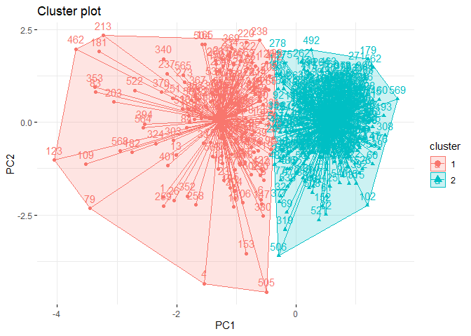<!-- -->

Bu grafik ise aşağıdaki maddelerle yorumlanabilir:

- Ayrışma sadece PC1 boyutunda gözlemlenmiştir.

- Küme 2’nin varyansu küme 1’den daha fazladır. Bunun nedeni kümelerin
  gözlem sayıları arasındaki fark olabilir.

- Kümeler arasında gözle görülür bir örtüşme yok.

Verileri `factoextra` paketinden `eclust` fonksiyonu ile de kümelemek
mümkündür.

``` r
k2m_data <- factoextra::eclust(df, # veri seti
                               "kmeans", # kümeleme algoritması
                               k = 2, # küme sayısı
                               nstart = 25, # iterasyon sayısı
                               graph = F # küme grafiğinin çizilip çizilmeyeceği
                               )
k2m_data # çıktı
```

    ## K-means clustering with 2 clusters of sizes 171, 398
    ## 
    ## Cluster means:
    ##         PC1         PC2
    ## 1 -3.001746  0.07482399
    ## 2  1.289695 -0.03214799
    ## 
    ## Clustering vector:
    ##   [1] 1 1 1 1 1 1 1 1 1 1 2 1 1 2 1 1 2 1 1 2 2 2 1 1 1 1 1 1 1 1 1 2 1 1 1 1 2
    ##  [38] 2 2 2 2 2 1 2 2 1 2 2 2 2 2 2 2 1 2 2 1 1 2 2 2 2 1 2 2 1 2 2 2 2 1 2 1 2
    ##  [75] 2 2 2 1 1 2 2 2 1 1 2 1 2 1 2 1 2 2 2 2 1 1 2 2 2 2 2 2 2 2 2 1 2 2 1 2 2
    ## [112] 2 1 2 2 2 2 1 1 2 2 1 1 2 2 2 2 1 1 1 2 1 1 2 1 2 2 2 1 2 2 2 2 2 2 2 1 2
    ## [149] 2 2 2 2 1 2 2 2 1 2 2 2 2 1 1 2 1 2 2 2 1 2 2 2 1 2 2 2 2 1 2 2 1 1 2 2 2
    ## [186] 2 2 2 2 2 1 2 2 2 1 2 1 1 1 2 2 1 1 1 2 2 2 2 2 2 1 2 1 1 1 2 2 2 1 1 2 2
    ## [223] 2 1 2 2 2 2 2 1 1 2 2 1 2 2 1 1 2 1 2 2 2 2 1 2 2 2 2 2 1 2 1 1 1 2 1 1 1
    ## [260] 1 1 2 1 2 1 1 2 2 2 2 2 2 1 2 2 2 2 2 2 2 1 2 1 1 2 2 2 2 2 2 2 2 2 2 2 2
    ## [297] 2 2 2 2 1 2 1 2 2 2 2 2 2 2 2 2 2 2 2 2 2 1 2 2 2 1 2 1 2 2 2 2 1 1 1 2 2
    ## [334] 2 2 1 2 1 2 1 2 2 2 1 2 2 2 2 2 2 2 1 1 2 2 2 2 2 2 2 2 2 2 2 2 1 1 2 1 1
    ## [371] 1 2 1 1 2 1 2 2 2 1 2 2 2 2 2 2 2 2 2 1 2 2 1 1 2 2 2 2 2 2 1 2 2 2 2 2 2
    ## [408] 2 1 2 2 2 2 2 2 2 2 1 2 2 2 1 2 2 2 2 2 2 2 2 1 2 1 1 2 2 2 2 2 2 2 1 2 2
    ## [445] 1 2 1 2 2 1 2 1 2 2 2 2 2 2 2 2 1 1 2 2 2 2 2 2 1 2 2 2 2 2 2 2 2 2 2 1 2
    ## [482] 2 2 2 2 2 2 1 2 2 2 2 1 2 2 2 2 2 1 1 2 1 2 1 1 2 2 2 2 1 2 2 1 2 2 2 1 1
    ## [519] 2 2 2 1 2 2 2 2 2 2 2 2 2 2 2 1 2 1 2 2 2 2 2 2 2 2 2 2 2 2 2 2 2 2 2 2 2
    ## [556] 2 2 2 2 2 2 2 1 1 1 1 2 1 2
    ## 
    ## Within cluster sum of squares by cluster:
    ## [1] 1216.540 1121.768
    ##  (between_SS / total_SS =  48.5 %)
    ## 
    ## Available components:
    ## 
    ##  [1] "cluster"      "centers"      "totss"        "withinss"     "tot.withinss"
    ##  [6] "betweenss"    "size"         "iter"         "ifault"       "silinfo"     
    ## [11] "nbclust"      "data"

***References for Chapter***

\[1\] Hartigan, John A., Manchek A. Wong. Algorithm AS 136: A k-means
clustering algorithm. Journal of royal statistical society. series c
(applied statistics) 28., 100–108, 1979

\[2\] Kassambara, Alboukadel. Practical guide to cluster analysis in R:
Unsupervised machine learning. Vol. 1. Sthda, 2017.

\[3\] James, G., Witten, D., Hastie, T., & Tibshirani, R. (2013). An
introduction to statistical learning (Vol. 112, p. 18). New York:
springer.

\[4\] Kassambara, Alboukadel. Practical guide to cluster analysis in R:
Unsupervised machine learning. Vol. 1. Sthda, 2017.

\[5\] Ben-Hur, Asa, and Isabelle Guyon. Detecting stable clusters using
principal component analysis. Functional genomics. Humana press,
159–182, 2003.

\[6\] Ding, Chris, and Xiaofeng He. K-means clustering via principal
component analysis. Proceedings of twenty-first international conference
on Machine learning. 2004.

# 4. k-medoidler

k-medoidler kümeleme algoritması, k-ortalamalar kümeleme algoritmasına
oldukça benzeyen, tıpkı onun gibi bölümlemeye dayalı bir algoritmadır.
Bir önceki bölümden de hatırlayabileceğiniz gibi, k-ortalamalar kümeleme
algoritmasında kümelerin her biri elemanlarının ortalamalarıyla temsil
edilmekteydi. k-medoids algoritmasında ise her küme elemanlarından
biriyle temsil edilir. Bir başka deyişle her küme merkezinde
elemanlarından biri yer alacak şekilde oluşturulur. Medoidler etrafında
bölümleme(Partitioning Around Medoids) olarak da isimlendirilen
k-medoidler kümeleme algoritmasının iterasyonlar sürecindeki ana amacı
medoidler ile diğer gözlemler arasındaki uzaklığı mümkün olduğunca
minimize etmektir \[1\], \[2\].

k-medoidler algoritması k-ortalamalar ile oldukça benzer olması
sebebiyle k-ortalamalarda kullanılan illüstrasyonları kullanacağım.
Fakat bu noktada dördüncü adıma dikkat edilmesi gerekmektedir. Lütfen,
aşağıdaki adımları incelerken dördüncü adımda yazılanlara dikkat edin.

**Adım 1**

Küme sayısı belirlenir.

**Adım 2**

Veri setinden küme sayısı yani k kadar rastgele gözlem küme merkezi
olarak seçilir. Bu adım aşağıdaki gibi illüstre edilebilir.


**Adım 3**

Her gözlemi kendisine en yakın olan küme merkezine ait kümeye atanır.
Her bir gözlemi aşağıdaki gibi atamaya başlayacağız.


**Adım 4**

Bu adım k-ortalamar ile k-medoidler algoritmalarının birbirinden
ayrıştığı adımdır. k-ortalamalarda merkez ortalamalar olurken
k-medoidlerde merkez o kümede yer alan bütün gözlemlere en yakın olan
bir gözlem olarak seçilir. Aşağıdaki illüstrasyon da yeni seçilen yıldız
imleçli noktalardan koyu renkli noktanın başka bir gözlem olduğunu
varsayın:


**Adım 5**

Küme atamaları artık değişmeyene veya maksimum iterasyon sayısına
ulaşana kadar 3. ve 4. adımları tekrarlanır. Bu iterasyonların sonunda
kümelememiz aşağıdaki gibi görünecektir:


## 4.1. R’da k-medoidler

R’da k-medoidler algoritmasını uygulamak için birçok paket ve fonksiyon
mevcuttur. Bu kitap özelinde `cluster` paketinde yer alan `pam`
fonksiyonunu kullanacağız. Tıpkı k-ortalamalar fonksiyonunda olduğu
gibi, kümeleme sonuçlarını yorumlayabilmek için sonucu bir nesneye
kaydedip print fonksiyonu ile bu nesnenin çıktısını yazdırmamız
gerekmektedir. Tüm bu işlemlerin uygulanması için aşağıdaki kodları
yazmamız gerekmektedir:

``` r
library(cluster)
pam_data <- pam(df,2)
print(pam_data)
```

    ## Medoids:
    ##       ID       PC1        PC2
    ## [1,] 499 -2.357211 0.30131315
    ## [2,] 269  1.358672 0.03762238
    ## Clustering vector:
    ##   [1] 1 1 1 1 1 1 1 1 1 1 2 1 1 1 1 1 2 1 1 2 2 2 1 1 1 1 1 1 1 1 1 2 1 1 1 1 2
    ##  [38] 2 2 2 2 2 1 2 2 1 2 1 2 2 2 2 2 1 2 2 1 1 2 2 2 2 1 2 2 1 2 2 2 2 1 2 1 2
    ##  [75] 2 1 2 1 1 2 2 1 1 1 2 1 2 1 2 1 2 1 2 2 1 1 2 2 2 2 2 2 2 2 2 1 2 2 1 2 2
    ## [112] 2 1 2 2 2 2 1 1 1 2 1 1 2 2 2 2 1 1 1 2 1 1 2 1 2 2 2 1 2 2 1 2 2 2 2 1 2
    ## [149] 2 2 2 2 1 2 2 2 1 2 2 2 2 1 1 2 1 2 2 1 1 2 2 2 1 2 2 2 2 1 2 2 1 1 2 2 2
    ## [186] 2 1 2 2 2 1 2 2 2 1 2 1 1 1 1 2 1 1 1 2 2 2 1 2 2 1 2 1 1 1 1 2 2 1 1 2 2
    ## [223] 2 1 2 2 2 2 2 1 1 2 2 1 2 2 1 1 2 1 2 2 2 2 1 2 2 2 2 2 1 2 1 1 1 2 1 1 1
    ## [260] 1 1 2 1 2 1 1 2 2 2 2 2 2 1 2 1 2 2 1 2 2 1 2 1 1 2 2 2 2 2 2 1 2 2 2 2 2
    ## [297] 2 2 2 2 1 2 1 2 2 2 2 2 2 2 2 2 2 2 2 2 2 1 2 2 2 1 2 1 2 2 2 2 1 1 1 2 2
    ## [334] 2 2 1 2 1 2 1 2 2 2 1 2 2 2 2 2 2 2 1 1 1 2 2 2 2 2 2 2 2 2 2 2 1 1 2 1 1
    ## [371] 1 2 1 1 2 1 2 2 2 1 2 2 2 2 2 2 2 2 2 1 2 2 1 1 2 2 2 2 2 2 1 2 2 2 2 2 2
    ## [408] 2 1 2 2 2 2 2 2 2 2 1 2 2 2 1 2 2 2 2 2 2 2 2 1 2 1 1 2 2 2 2 2 2 2 1 2 2
    ## [445] 1 2 1 2 2 1 2 1 2 2 2 2 2 2 2 2 1 1 2 2 2 2 2 2 1 2 2 2 2 2 2 2 2 2 2 1 2
    ## [482] 2 2 2 1 2 2 1 2 2 2 2 1 2 2 2 2 2 1 1 2 1 2 1 1 2 2 2 2 1 2 2 1 2 2 2 1 1
    ## [519] 2 2 2 1 2 2 2 2 2 2 2 2 2 2 2 1 2 1 1 2 2 2 2 2 2 2 2 2 2 2 2 2 2 2 2 2 2
    ## [556] 2 2 2 2 2 2 2 1 1 1 1 1 1 2
    ## Objective function:
    ##    build     swap 
    ## 1.806580 1.700399 
    ## 
    ## Available components:
    ##  [1] "medoids"    "id.med"     "clustering" "objective"  "isolation" 
    ##  [6] "clusinfo"   "silinfo"    "diss"       "call"       "data"

`print` fonksiyonu ile elde edilen çıktıyı inceleyecek olursak; ilk
başta hem PC1 hem de PC2 boyutları için her bir kümenin medoid bilgisine
erişebiliriz. İlk kümenin merkezinin veri setindeki 499. indekse sahip
gözlem olduğunu, ikinci kümenin ise 269. indekse sahip olan gözlem
olduğunu fark ederiz.. Ardından, her bir gözlemin hangi kümeye atandığı
bilgisini içeren kümeleme vektörünü görüyoruz. Son olarak da amaç
fonksiyonunu görüyoruz. “Build” k-medianlar hesaplamasındaki birinci
adımı, “Swap” ise üçüncü adımı temsil etmektedir.

Tıpkı k-ortalamalarda olduğu gibi, `factoextra` paketinde yer alan
`fviz_cluster` fonksiyonu ile kümeleme grafiğini aşağıdaki gibi
çizdirebiliriz:

``` r
library(factoextra)
fviz_cluster(pam_data,# clustering result
             data = df, # data
             ellipse.type = "convex", # type of the clusters' appearence
             repel = F, 
             ggtheme = theme_classic()
)
```

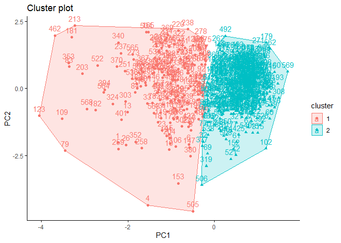<!-- -->

***References for Chapter***

\[1\] Kaufman, L., & Rousseeuw, P. (1987). Clustering by means of
medoids. Statistical Data Analysis Based on the L1-Norm and Related
Methods, Y. Dodge Ed.

\[2\] Kaufman, L., & Rousseeuw, P. J. (2009). Finding groups in data: an
introduction to cluster analysis. John Wiley & Sons

# 5. Hiyerarşik Kümeleme

Hiyerarşik Kümeleme, nesnelerin dendrogram adı verilen, kümelerin ağaç
benzeri bir yapıda organize edildiği bir algoritmadır. İki ana
hiyerarşik kümeleme türü vardır: Birleştirici (Agglomerative) ve
Ayrıştırıcı (Divisive). \[1\], \[2\], \[3\] Ayırıcı Hiyerarşik
Kümelememe veri setini tek bir küme olarak olarak kabul ettikten sonra
benzerliklerine göre yinelemeli olarak daha küçük kümeler halinde
ayrıştırırken, Birleştirici Hiyerarşik Kümeleme her bir gözlemi bir küme
olarak kabul ettikten sonra benzerliklerine göre yinelemeli olarak daha
büyük kümeler halinde birleştirmektedir. Bu noktada önemli olan kısım bu
birleştirmelerin/ayrıştırmaların nasıl yapıldığıdır. Bunun için çeşitli
bağlantı yöntemleri geliştirilmiştir. Aşağıda bu bağlantı yöntemlerinin
isimlerini ve bağlantı işlemlerinin nasıl yapıldığını görebilirsiniz:

Tek bağlantı: En yakın komşu yöntemi olarak da bilinen bu yöntem,
birleştirilen/ayrıştırılan iki kümenin en yakın noktaları arasındaki
mesafeyi hesaplar\[4\]. Aşağıdaki illüstrasyon bunu açıklamak için
faydalı olabilir:


Tam bağlantı: En uzak komşu yöntemi olarak da bilinen bu yöntem,
birleştirilen/ayrıştırılan iki kümenin en uzak noktaları arasındaki
mesafeyi hesaplar\[5\].


Ortalama bağlantı: Bu yöntem, birleştirilen iki kümedeki tüm nokta
çiftleri arasındaki ortalama mesafeyi hesaplar. \[6\]


Ward’ın Minimum Varyans bağlantısı: Bu yöntem, aynı küme içindeki
noktalar arasındaki uzaklıkların varyansını en aza indirir. Her bir küme
içindeki karesel uzaklıkların toplamında en küçük artışa neden olan
kümeleri birleştirir \[7\].

Her yöntemin kendine has güçlü ve zayıf yönleri olduğundan, bağlantı
yönteminin seçimi ortaya çıkan kümeler üzerinde önemli bir etkiye sahip
olabilir. Bu nedenle, veriler ve ele alınan spesifik problem için hangi
bağlantı yönteminin en uygun olduğunu dikkatlice değerlendirmek
önemlidir. Tıpkı küme sayısı belirleme methodlarında olduğu gibi; birden
çok bağlantıyı kullanarak kümeleme yaptıktan sonra sonuçları analiz
etmek çok daha faydalı olacaktır. Bu kitaptaki R uygulamarında yalnızca
Ward’ın Minimum Varyans Yöntemi ile Ortalama bağlantı yöntemi olmak
üzere iki metrik kullanılmıştır.

## 5.1. Kojenetik Mesafe

Daha önceki bölümlerde uzaklık metrikleri uygulamalarında genellikle
Öklit metriğinin kullanıldığından bahsetmiştik. Hiyerarşik kümeleme
özelinde uzaklık metriğine karar vermek Kojenetik mesafe ile de karar
verebiliriz. Kojenetik mesafe, kümeleme algoritması tarafından üretilen
dendrogramdaki iki gözlem arasındaki benzerliği değerlendirmek için
hiyerarşik kümelemede kullanılan bir ölçüdür. Orijinal veri uzayında,
dendrogramda aynı kümede ilk kez birleştikleri seviyede iki gözlem
arasındaki mesafe olarak tanımlanır\[8\]. Kojenetik mesafe ile veri
uzayındaki gözlemler arasındaki orijinal mesafe arasındaki yüksek
korelasyon, kümeleme çözümünün verinin yapısını iyi koruduğunu gösterir.

### 5.1.1. R’de Kojenetik Mesafe

`stats` paketindeki cophenetic fonksiyonu R’da kojenetik mesafetyi
hesaplamamıza olanak sağlamaktadır. Ancak ik önce, karşılaştıracağımız
iki uzaklık metriğinin(bu uygulama özelinde Öklid ve Manhattan) uzaklık
matrislerini hesaplamamız gerekmektedir. Bunun için yine `stats`
paketinde yer alan `dist` fonksiyonunu kullanacağız.

  

``` r
dist_euc <- dist(df, method="euclidean") # veri, uzaklık metriği
dist_man <- dist(df, method="manhattan") # veri, uzaklık metriği
```

Ardından veri setimizi her iki uzaklık metriği ile hiyerarşik kümeleme
algoritmasını uygulamamız gerekmektedir. Bu bölümde özelinde Ward
bağlantıyı kullanalım:

``` r
hc_e <- hclust(d=dist_euc, method="ward.D2")
hc_m <- hclust(d=dist_man, method="ward.D2")
```

Son olarak, her iki kümeleme için de kojenetik mesafeyi hesaplamamız ve
mesafe metriği ile kojenetik mesafe arasındaki korelasyon katsayısını
kontrol etmemiz gerekir.

``` r
# öklid için
coph_e <- cophenetic(hc_e)
cor(dist_euc,coph_e)
```

    ## [1] 0.6711685

``` r
# manhattan için
coph_m <- cophenetic(hc_m)
cor(dist_man,coph_m)
```

    ## [1] 0.6018289

Genel olarak, daha yüksek bir korelasyon katsayısı, dendrogramın
orijinal veri noktaları arasındaki ikili mesafelerin daha doğru bir
temsili olduğunu gösterir. Kofenetik korelasyon katsayısı 0 ile 1
arasında değişebilir ve 1 değeri dendrogram ile ikili mesafeler arasında
mükemmel bir uyum olduğunu gösterir.

Bu durumda, Cophenetic ve mesafe matrisi arasındaki korelasyon
incelendiğinde, Öklid mesafesi ile hiyerarşik kümelemenin daha iyi
sonuçlar verdiği söylenebilir. Bu yüzden analize Öklid uzaklık metriği
ile devam edeceğiz.

## 5.2. R’da Ward’ın Minimum Varyans Bağlantısı

Hiyerarşik kümelemede küme sayısını belirlemek için, tıpkı k-ortalamalar
ve k-medoidlerde yaptığımız gibi, en uygun küme sayısını belirleme
yöntemlerini kullanabiliriz. Bu konuyu Bölüm 2’de ele aldığımız için bu
bölümde değinilmeyecektir. Ancak, tüm yöntemlerin en uygun küme sayısı
olarak 2’yi önerdiğini hatırlatmak faydalı olabilir.

Hiyerarşik kümeleme için küme sayısını belirlemekte kullanılabilecek bir
başka yol da dendogramı kontrol ederek nereden kesileceğine karar
vermektir. Ancak ben kişisel olarak bu yöntemi “açık uçlu” buluyorum.
Yine de kodları ve dendogramı sizlerle paylaşacağım.

Hiyerarşik kümelemeden oluşturduğunuz nesne ile hiyerarşik kümelemenin
dendogramını `stats` paketinden `hclust` fonksiyonu ile görselleştirmek
için `factoextra` paketindeki `fviz_dend` fonksiyonunu
kullanabilirsiniz.

``` r
hc_e <- hclust(d=dist_euc, method="ward.D2")
fviz_dend(hc_e,cex=.5) 
```

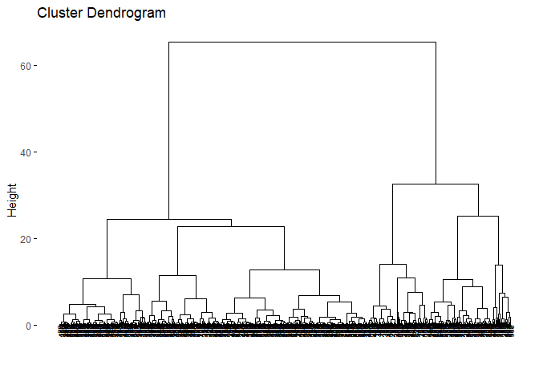<!-- -->

Oldukça karışık görünmesiyle birlikte, dendogramı kesmek için en iyi
yükseklik değerinin 35-40 aralığında olduğu söylenebilir. Bu aynı
zamanda 2 kümeyi ifade eder. Veri kümesini 2 küme ile hiyerarşik olarak
kümeleyelim. Bunu yapmak için `stats` paketindeki `cutree` fonksiyonu
kullanılabiliriz.

``` r
grupward2 <- cutree(hc_e, k = 2)
table(grupward2) # her kümedeki eleman sayısını verir
```

    ## grupward2
    ##   1   2 
    ## 180 389

``` r
grupward2 # kümeleme vektörünün çıktısı
```

    ##   [1] 1 1 1 1 1 1 1 1 1 1 2 2 1 2 1 1 2 1 1 2 2 2 1 1 1 1 1 1 1 1 1 1 1 1 1 1 2
    ##  [38] 2 2 2 2 1 1 1 2 1 2 1 2 2 2 2 2 1 2 2 1 1 2 2 2 2 1 2 1 1 2 2 1 2 1 2 1 2
    ##  [75] 2 2 1 1 1 2 2 1 1 1 2 1 2 1 2 1 2 2 2 2 1 1 2 2 2 2 2 2 2 2 2 1 2 2 1 2 2
    ## [112] 2 1 2 2 2 2 1 1 2 2 1 1 2 2 2 2 2 1 1 2 2 2 2 1 2 2 2 1 2 2 2 2 2 2 2 1 2
    ## [149] 2 2 2 2 1 2 2 2 1 2 2 2 2 1 1 2 1 2 2 2 1 2 2 2 1 2 2 2 2 1 2 2 1 1 2 2 2
    ## [186] 2 2 2 2 2 1 2 2 1 1 2 1 2 1 2 2 2 1 1 2 2 2 2 1 2 1 2 1 1 2 1 2 2 1 1 2 2
    ## [223] 2 2 2 2 2 2 2 1 1 2 2 1 2 2 1 1 2 1 2 2 2 2 1 2 2 2 2 2 1 2 1 1 1 2 1 1 1
    ## [260] 1 1 2 1 2 1 1 2 2 2 2 2 2 1 2 2 2 2 2 2 2 1 2 1 1 2 2 2 2 2 2 2 2 2 2 2 2
    ## [297] 2 2 2 2 1 2 1 2 2 2 2 2 2 2 2 2 2 2 2 2 2 1 1 2 2 1 2 1 2 2 2 2 1 1 2 2 2
    ## [334] 2 2 1 2 1 2 1 2 2 2 1 2 2 2 2 2 2 2 1 1 2 2 2 1 2 2 2 2 2 2 2 2 1 1 2 1 1
    ## [371] 1 2 1 1 2 2 1 2 2 1 2 2 2 2 2 2 2 2 2 1 2 2 1 1 2 2 2 2 2 2 1 2 2 2 2 2 2
    ## [408] 2 1 2 2 2 2 2 2 2 2 1 2 2 2 1 2 2 2 2 2 2 2 2 1 2 1 1 2 2 2 2 2 2 2 2 2 2
    ## [445] 1 2 1 2 2 1 2 1 2 2 2 2 2 2 2 2 1 1 2 2 2 2 2 2 1 1 2 2 2 2 2 2 2 2 2 1 2
    ## [482] 2 2 2 2 1 2 1 2 2 2 2 1 2 2 2 2 2 1 1 2 1 2 1 1 1 2 2 2 1 2 2 1 2 2 2 1 1
    ## [519] 1 2 2 1 2 2 2 2 2 2 1 2 2 2 2 1 2 1 2 1 2 2 2 2 2 2 2 2 2 2 2 2 2 2 2 2 2
    ## [556] 2 2 2 2 2 2 2 1 1 1 1 2 1 2

Küme atamaları sonrası dendogramı görmek için `factoextra` paketinde yer
alan `fviz_dend` fonksiyonunu kullanabiliriz.

``` r
fviz_dend(hc_e, # kümeleme sonucu
          k = 2, # küme sayısı
          cex = 0.5, 
          color_labels_by_k = TRUE, 
          rect = TRUE )
```

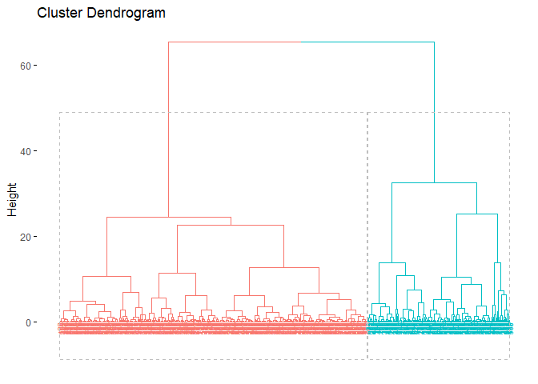<!-- -->

Tıpkı diğer kümeleme yöntemlerinde olduğu gibi küme grafiğini
`fviz_cluster` fonksiyonu ile çizebiliriz:

``` r
fviz_cluster(list(data = pcadata, cluster = grupward2),
             ellipse.type = "convex", 
             repel = F, 
             show.clust.cent = FALSE, ggtheme = theme_minimal())
```

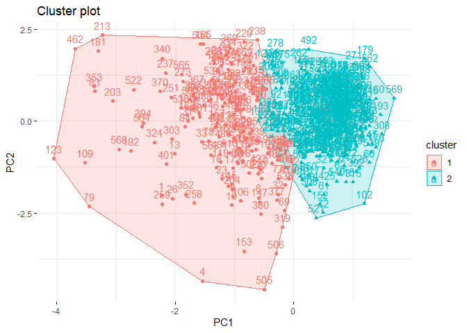<!-- -->

Küme grafiği incelendiğinde örtüşme olduğunu gözlemleyebiliriz.
Ayrışmanın sadece PC1 boyutunda gerçekleştiği görülebilir. Kırmızı ile
gösterilen ilk kümedeki varyans yüksek iken, yeşil ile gösterilen ikinci
kümedeki varyans düşüktür.

## 5.3. R’da Ortalama Bağlantı Yöntemi

Kojenetik uzaklık Ward’ın Minimum Varyans Yönteminde ele alındığı için
bu bölümde sizlerle paylaşılmayacaktır. Ancak Öklid uzaklığının yine
daha iyi sonuçlar verdiğini belirtmek gerekir. Yine `stats` paketindeki
`hclust` fonksiyonu ile hiyerarşik kümelemeden oluşturduğunuz nesne ile
hiyerarşik kümelemenin dendogramını görselleştirmek için `factoextra`
paketindeki `fviz_dend` fonksiyonunu kullanabilirsiniz.

``` r
hc_e2 <- hclust(d=dist_euc, method="average")
fviz_dend(hc_e2,cex=.5) 
```

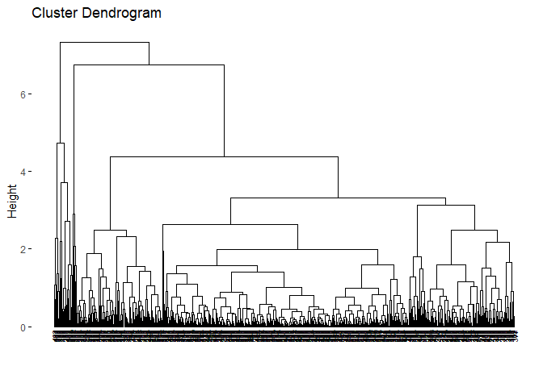<!-- -->

Dendogramı ilk bakışımızda bile Ward’ın sonucunda oldukça ayrıştığı fark
edilmektedir. Kümelerin Ward’a göre oldukça dengesiz olduğu
görülmektedir. Bu durum küme analizi için sorun yaratabilir. Bununla
birlikte, bağlantı yönteminin veri setine büyük ölçüde bağlı olduğunu
göstermek için faydalı bir örnektir. Veriler için en iyi bağlantı
yöntemine karar vermek çok önemlidir. Bağlantıya karar vermenin bir
yolu, aykırı değerlerin olup olmadığını görmek için veri setinin
tanımlayıcı istatistiklerini kontrol etmektir. Başka bir yol da hangi
dendogramın iyi göründüğünü görmek için tüm bağlantı yöntemlerini
denemektir.

Tıpkı diğer yöntemlerde olduğu gibi iki küme sayısı ile devam edelim:

``` r
grupav2 <- cutree(hc_e2, k = 2)
grupav2
```

    ##   [1] 1 2 2 2 2 2 2 2 2 2 2 2 1 2 2 2 2 2 2 2 2 2 2 2 2 1 2 2 2 2 2 2 2 2 2 2 2
    ##  [38] 2 2 2 2 2 2 2 2 2 2 2 2 2 2 2 2 2 2 2 2 2 2 2 2 2 2 2 2 2 2 2 2 2 2 2 2 2
    ##  [75] 2 2 2 2 1 2 2 2 1 2 2 2 2 2 2 2 2 2 2 2 2 2 2 2 2 2 2 2 2 2 2 2 2 2 1 2 2
    ## [112] 2 2 2 2 2 2 2 2 2 2 2 1 2 2 2 2 2 2 2 2 2 2 2 2 2 2 2 2 2 2 2 2 2 2 2 2 2
    ## [149] 2 2 2 2 2 2 2 2 2 2 2 2 2 2 2 2 2 2 2 2 2 2 2 2 2 2 2 2 2 2 2 2 1 1 2 2 2
    ## [186] 2 2 2 2 2 2 2 2 2 2 2 2 2 2 2 2 2 1 2 2 2 2 2 2 2 2 2 1 2 2 2 2 2 2 2 2 2
    ## [223] 2 2 2 2 2 2 2 2 2 2 2 2 2 2 2 2 2 2 2 2 2 2 2 2 2 2 2 2 2 2 2 2 2 2 2 1 1
    ## [260] 2 2 2 2 2 2 2 2 2 2 2 2 2 2 2 2 2 2 2 2 2 2 2 2 2 2 2 2 2 2 2 2 2 2 2 2 2
    ## [297] 2 2 2 2 2 2 1 2 2 2 2 2 2 2 2 2 2 2 2 2 2 2 2 2 2 2 2 1 2 2 2 2 2 2 2 2 2
    ## [334] 2 2 2 2 2 2 2 2 2 2 2 2 2 2 2 2 2 2 1 1 2 2 2 2 2 2 2 2 2 2 2 2 2 2 2 2 2
    ## [371] 2 2 2 2 2 2 2 2 2 2 2 2 2 2 2 2 2 2 2 2 2 2 2 1 2 2 2 2 2 2 1 2 2 2 2 2 2
    ## [408] 2 2 2 2 2 2 2 2 2 2 2 2 2 2 2 2 2 2 2 2 2 2 2 2 2 2 2 2 2 2 2 2 2 2 2 2 2
    ## [445] 2 2 2 2 2 2 2 2 2 2 2 2 2 2 2 2 2 1 2 2 2 2 2 2 2 2 2 2 2 2 2 2 2 2 2 2 2
    ## [482] 2 2 2 2 2 2 2 2 2 2 2 2 2 2 2 2 2 2 2 2 2 2 2 2 2 2 2 2 2 2 2 2 2 2 2 2 2
    ## [519] 2 2 2 1 2 2 2 2 2 2 2 2 2 2 2 2 2 2 2 2 2 2 2 2 2 2 2 2 2 2 2 2 2 2 2 2 2
    ## [556] 2 2 2 2 2 2 2 2 1 2 2 2 1 2

``` r
table(grupav2)
```

    ## grupav2
    ##   1   2 
    ##  23 546

Çıktıdan da görebileceğimiz gibi, kümeler oldukça dengesiz -ki bunu
dendogramdan da kolaylıkla tahmin etmiştik. Küme atamalarıyla dendogramı
renklendirmek bu bağlantı yöntemi için de geçerli:

``` r
fviz_dend(hc_e2, k = 2, 
          cex = 0.5, 
          color_labels_by_k = TRUE, 
          rect = TRUE )
```

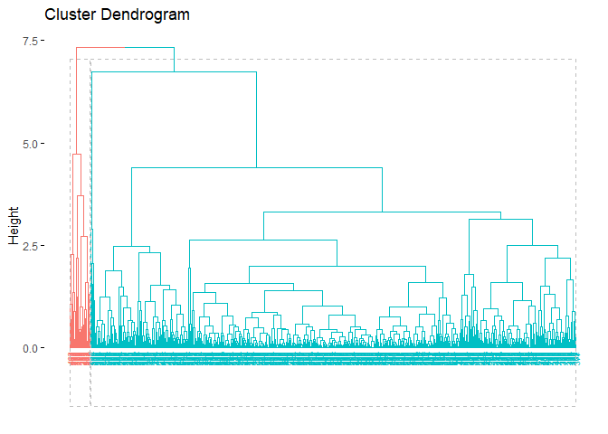<!-- -->

Küme grafiğine bakalım:

``` r
fviz_cluster(list(data = pcadata, cluster = grupav2),
             ellipse.type = "convex", 
             repel = F, 
             show.clust.cent = FALSE, ggtheme = theme_minimal())
```

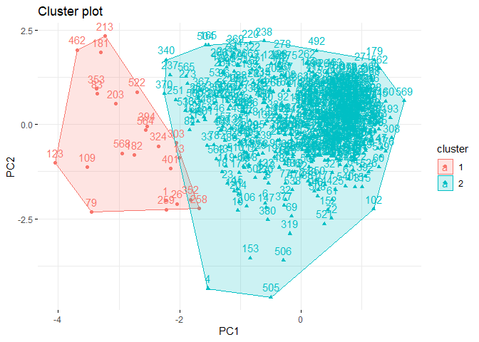<!-- -->

***References for Chapter***

\[1\] Ward Jr, J. H. (1963). Hierarchical grouping to optimize an
objective function. Journal of the American statistical association,
58(301), 236–244.

\[2\] Roux, M. (2015). A comparative study of divisive hierarchical
clustering algorithms. arXiv preprint arXiv:1506.08977.

\[3\] Kassambara, Alboukadel. Practical guide to cluster analysis in R:
Unsupervised machine learning. Vol. 1. Sthda, 2017.

\[4\] Kassambara, Alboukadel. Practical guide to cluster analysis in R:
Unsupervised machine learning. Vol. 1. Sthda, 2017.

\[5\] Kassambara, Alboukadel. Practical guide to cluster analysis in R:
Unsupervised machine learning. Vol. 1. Sthda, 2017.

\[6\] Kassambara, Alboukadel. Practical guide to cluster analysis in R:
Unsupervised machine learning. Vol. 1. Sthda, 2017.

\[7\] Ward Jr, J. H. (1963). Hierarchical grouping to optimize an
objective function. Journal of the American statistical association,
58(301), 236–244.

\[8\] Triayudi, A., & Fitri, I. (2018). Comparison of parameter-free
agglomerative hierarchical clustering methods. ICIC Express Letters,
12(10), 973–980.

# 6. Yoğunluk Bazlı Kümeleme

Güzel bir hava, iş/okul yok, arkadaşlarınızla/ailenizle birlikte
arabanızı yeşillik alana doğru sürmüşsünüz. Güzel havayı ciğerlerinize
doğru çekerken hafif açlığınızın olduğunu hissediyorsunuz. Ev yapımı
çilek reçeli ve yer fıstığı ezmesini ekmekle birlikte çantanızdan
çıkarıyorsunuz. Ancak maalesef reçelin bir kısmı yere dökülüyor.
Karşılaşabileceğiniz olası durumlar ne olurdu? Büyük ihtimalle bir
karınca sürüsü seçele doğru yol yapar, hatta reçelin döküldüğü noktadaki
karınca sayısında bir yoğunluk olurdu.Yoğunluk tabanlı kümeleme, belirli
bir yarı çaplı daire içerisinde birbirine daha yakın olan karıncaları
bir araya getirip henüz reçele ulaşamayan, reçele doğru yaklaşmakta olan
yani daha seyrek olan karıcaları ise ayıran bir kümeleme algoritmasıdır.
Yoğunluk tabanlı kümelemenin arkasındaki ana fikir, özellik uzayında
veri noktalarının yoğun olduğu bölgeleri belirlemek ve ardından bu
bölgelere dayalı kümeler çıkarmaktır\[1\]. Yoğunluk bazlı kümeleme,
kümeleri diğer yoğun bölgelerden daha düşük nokta yoğunluğuna sahip
bölgelerle ayrılan yoğun nokta bölgeleri olarak tanımlars\[2\]. Diğer
bütün kümeleme algoritmalarıyla arasındaki fark, diğer bütün
algoritmalar bütün gözlemleri bir kümeye atarken yoğunluk bazlı
kümelemede bazı gözlemler bir kümeye atanmayabilir.

Yoğunluk tabanlı kümelemenin bu kitapta anlatılan diğer algoritmalardan
bir diğer farkı ise, küme sayısının önceden belirlenmesine gerek
olmamasıdır. Ancak MinPts ve eps değerlerinin belirlenmesi
gerekmektedir. *eps* parametresi bir gözlem etrafında dolaşacak olan
çemberin yarıçapını tanımlar. Buna gözlemin epsilon komşuluğu da denir.
MinPts parametresi “eps” yarıçapı içindeki minimum komşu sayısıdır. Yani
çemberin içine kaç gözlem alınacağının belirlenmesidir. Bu değerleri
belirlemek için KNN distplot kullanılabilir. Uygulama kısmında KNN
distplot’la bu değerlere nasıl karar verildiğini göreceğiz.

Yoğunluk bazlı kümeleme algoritması sonucunda gözlemler kümelenir veya
kümelenmezken üç farklı gözlem türü (çekirdek noktaları, sınır noktaları
ve gürültü noktaları) oluşur. Çekirdek nokta, epsilon komşuluğu içinde
en az MinPts olan noktadır. Başka bir deyişle, bir çekirdek noktanın bir
kümenin parçası olarak kabul edilmesi için yeterli sayıda yakın komşusu
vardır. Sınır noktası, çekirdek nokta olmayan ancak bir çekirdek
noktanın epsilon komşuluğu içinde yer alan bir noktadır. Sınır noktaları
bir kümenin parçası olarak kabul edilebilir, ancak kümeye çekirdek
noktalar kadar güçlü bir şekilde bağlı değildirler. Gürültü noktası,
epsilon komşuluğu içinde herhangi bir çekirdek noktası bulunmayan bir
noktadır. Gürültü noktaları genellikle aykırı değerler olarak kabul
edilir ve herhangi bir kümenin parçası değildir. Tam olarak da gürültü
noktaları oluşumuyla Yoğunluk Bazlı Kümeleme diğer kümeleme
algoritmalarından ayrılır.

Aşağıdaki adımlar Yoğunluk Bazlı Kümelemenin anlaşılması için daha
faydalı olabilir:

1.  MinPts ve epsilon değerleri belirlenir.
2.  Sınır noktaları tanımlanır.
3.  Bir çekirdek noktadan başlayarak epsilon komşuluğu içindeki tüm
    gözlemler bulunur ve aynı kümeye atanır. Bu işlem her bir çekirdek
    nokta için tekrarlar ve kümedeki başka bir gözlemle epsilon mesafesi
    içinde oldukları sürece aynı kümeye gözlem eklenmeye devam edilir.
4.  Algoritma, tanımlanan kümelerin çıktısını verir.

Tüm bu işlemler aşağıdaki küçük animasyon\[3\] gibi gerçekleşir:


Özetlemek gerekirse, Yoğunluk Bazlı Kümeleme algoritması özellikle
farklı yoğunlaşmış veri setleri için oldukça faydalıdır. Hiyerarşik ve
bölümlemeye dayalı(k-ortalamalar, k-medoidler) gibi algoritmalar
kümeleri yalnızca eliptik şekilde kümelerken, Yoğunluk Bazlı Kümelemenin
böyle bir kısıtlamasının olmaması bir artı olarak dikkat çeker. Ancak
diğer kümeleme algoritmalarına kıyasla boyutu yüksek verilerde de daha
başarısız olduğu söylenebilir.

## 6.1. R’da Yoğunluk Bazlı Kümeleme

Diğer kümeleme algoritmaları gibi, Yoğunluk Bazlı Kümeleme de R
aracılığıyla oldukça basit bir şekilde yapılabilir. `fpc` paketinde yer
alan `dbscan` fonksiyonu ile rahatlıkla bu işlemi yapabiliriz. Ancak
daha önce de söylediğim gibi, MinPts ve eps değerlerinin önceden
belirlenmesi gerekmektedir. Bu nedenle, ilk adım olarak bu parametrelere
karar vermek için bir kNN distplot çizeceğiz.

``` r
library(fpc)
library(dbscan)
kNNdistplot(df, # veri seti 
            k = 10 # minpts
            )
abline(h = 1, lty = 2) # yatay çizgi
abline(h = 0.6, lty = 2)# yatay çizgi 2
```

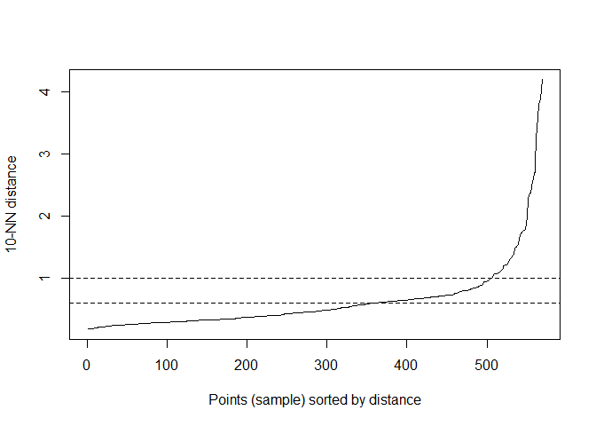<!-- -->

kNNdisplot analiz edilirken, tıpkı Dirsek Yönteminde olduğu gibi,
doğrunun “dirsek” yaptığı nokta belirlenmelidir. Bu nokta eps değeri
olarak seçilmelidir. Çeşitli denemelerden sonra en uygun değerin 0,6
olduğuna karar verilmiştir.

MinPts ve eps değerlerine de karar verdiğimize göre şimdi Yoğunluk Bazlı
Kümeleme yapabiliriz:

``` r
db <- fpc::dbscan(df, eps = 0.6, MinPts = 10)
print(db)
```

    ## dbscan Pts=569 MinPts=10 eps=0.6
    ##         0   1   2
    ## border 96  58  27
    ## seed    0  49 339
    ## total  96 107 366

Çıktıyı analiz edersek, aşağıdaki yorumları yapabiliriz:

Yoğunluk tabanlı kümeleme veri setini iki kümeye ayırmıştır.

Çıktı, herhangi bir kümeye atanamayan toplam 96 gürültü değeri
göstermektedir.

Birinci kümede 58, ikinci kümede ise 27 sınır noktası bulunmaktadır.

Birinci kümede 49, ikinci kümede 339 çekirdek noktası bulunmaktadır.

Önceki kümeleme algoritmalarında yaptığımız gibi, `factoextra`
paketindeki `fviz_cluster` fonksiyonu ile küme grafiğini de
görselleştirebiliriz:

``` r
fviz_cluster(db, data = df, stand = FALSE,
             ellipse = FALSE, show.clust.cent = FALSE,
             geom = "point",palette = "jco", ggtheme = theme_classic())
```

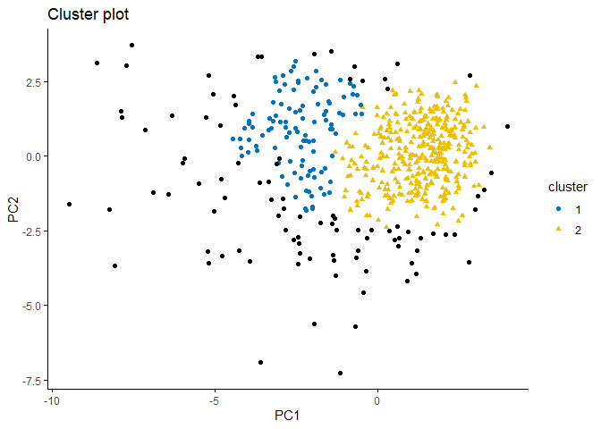<!-- -->

Grafik incelendiğinde, kümeler arasındaki gözlem farkının küçük olduğu
görülebilir. Gürültü değerlerinin fazlalığı da (siyah noktalar) dikkat
çekicidir.

**References for Chapter**

\[1\] Kriegel, H. P., Kröger, P., Sander, J., & Zimek, A. (2011).
Density‐based clustering. Wiley interdisciplinary reviews: data mining
and knowledge discovery, 1(3), 231–240.

\[2\] Bäcklund, H., Hedblom, A., & Neijman, N. (2011). A density-based
spatial clustering of application with noise. Data Mining TNM033, 33,
11–30.

\[3\] <https://ml-explained.com/blog/dbscan-explained>

# 7. Küme Geçerliliği

Şimdiye kadar dört farklı kümeleme algoritmasının nasıl çalıştığını,
arkalarında yatan ana fikirleri ve R programlama dili ile bu
algoritmaların nasıl uygulandığını gördük. Peki kümeleme analizi
kümelemenin yapılmasıyla sonlanan, yüzeysel bir analiz olabilir mi?
Kaggle, Github ve benzeri birçok platforma bakarsanız, evet. Çoğu
analizde küme geçerlili metriklerinin değerlendirildiğini görmek oldukça
zor. Ancak bu oldukça sorunlu bir durum. Bu tıpkı R^2 bakılmayan bir
regresyon analizi, hatta daha da ötesi varsayımların kontrol edilmediği
bir regresyon analizi yapmak kadar vahim bir durumdur. Bu sebeple küme
geçerliliği oldukça önemlidir.

Küme geçerliliği metrikleri kabaca iki kategoriye(Dahili Küme
Geçerliliği ve Harici Küme Geçerliliği) ayrılır. Dahili küme
geçerliliği, bir kümenin kendi içinde ne kadar homojen olduğunu ölçer.
Dahili küme doğrulama ölçütleri kümeleme algoritmasının kendisiyle
ilgili olduğu için küme sayısına, küme boyutuna, gözlem sayısına ve veri
boyutuna(değişken sayısı) göre değişebilir. Dahili Küme geçerliliği
metriklerinden bazılarını(Silhouette, Calinski-Harabasz, Davies-Bouldin,
Dunn) zaten ikinci bölümde görmüştük. Bu sebeple onların nasıl çalıştığı
ile ile detaylı bir açıklama burada tekrar yapılmayacak. Fakat bir başka
dahili küme geçerliliği metiriği olan Connectivity’nin nasıl çalıştığına
bakacağız.

Harici küme geçerliliği, kümeleme sonuçlarının harici verilerle
karşılaştırılmasıyla ölçülür. Aynısı bir sınıflandırma probleminde de
sınıflandırma sonuçlarının gerçek sınıflarla karşılaştırılmasıyla
yapılmaktadır. Bu sebeple harici küme geçerliliği metriklerinin
uygulanabilmesi için etiketlere yine ihtiyaç duyarız. Birçok harici küme
geçerlili metriği olmakla birlikte bu kitapta Düzeltilmiş Rand Indeksi
ve Meila’s Variation of Information metriklerini inceleyeceğiz.

Tüm analizlerde yine aynı veri seti kullanılacaktır.

## 7.1. Connectivity

Connectivity kümedeki her bir gözlem ile o gözlemin dahil olduğu küme
içindeki diğer tüm gözlemler arasındaki uzaklıkların ortalaması alınarak
hesaplanır. Kümenin bir bütün olarak ne kadar homojen olduğunu ve
kümeleme yönteminin başarısını belirlemek için kullanılır. Düşük
Connectivity değeri, bir kümenin homojen olduğunu ve iyi bir kümeleme
sonucu verdiğini gösterir\[1\].

### 7.1.1. R’da Connectivity

Connectivity `clValid` paketinde yer alan `connectivity` fonksiyonu ile
kolaylıkla hesaplanabilir. Fonksiyonun girdileri küme vektörü, veri
seti, komşu sayısı(deneysel olarak değiştirilebilir) ve uzaklık
metriğidir:

``` r
library(clValid)
k2m_data <- kmeans(df, 2, nstart = 25)


connectivity(distance = NULL, k2m_data$cluster, Data = df, neighbSize = 20,
             method = "euclidean")
```

    ## [1] 64.96498

## 7.2. Düzeltilmiş Rand Indeksi

Düzeltilmiş Rand endeksi (DRI), iki farklı küme bilgisini karşılaştıran
bir geçerlilik metriğidir. Her iki kümeleme çözümünde de doğru
sınıflandırılmış gözlemlerin oranını ölçen Rand endeksinin değiştirilmiş
bir versiyonudur. Düzeltilmiş Rand endeksi -1 ile 1 arasında değişir ve
1’e ne kadar yakınsa o kadar başarılı bir sonucu işaret eder.

### 7.2.1. R’da Düzeltilmiş Rand Indeksi

`fpc` paketinde yer alan `cluster.stats` fonksiyonu ile Düzeltilmiş Rand
Indeksi kolaylıkla hesaplanabilir. Daha önceden de bahsedildiği gibi R,
kümeleme sonucu oluşan kümeleri sırasıyla 1,2,3 olarak
isimlendirmektedir. Veri setindeki etiket(bu kitapta örnek olarak
kullanılan veri setinde M ve B şeklinde iki etiket vardır) ne olursa
olsun, o etiketin de aynı şekilde dönüştürülmesi gerekmektedir.
Aşağıdaki kod çerçevesinde ilk satırda bu dönüşüm yapılmıştır. Ayrıca
`cluster.stats` fonksiyonu birçok değer hesaplayan bir fonksiyondur.
Özellikle Düzeltilmiş Rand indeksine ulaşmak istiyorsak “\$” işareti ile
`corrected.rand` ifadesini eklememiz gerekmektedir.

``` r
diagnosis <- ifelse(wdbc$Diagnosis == "M",1,2 )# it is necessary to make labels numerical
cluster.stats(d = dist(df),diagnosis, k2m_data$cluster)$corrected.rand
```

    ## [1] 0.6465881

## 7.3. Meila’s Variation of Information

İki kümeleme çözümü arasındaki benzerliğin bir kümelemeden diğerine
geçerken kazanılan veya kaybedilen bilgi miktarı ile ölçülebileceği
fikrine dayanan Meila’s Variation of Information(MVI) metriği, her bir
kümeleme çözümünün entropisini karşılaştırır ve n gözlem sayısı olmak
üzere 0 ile log(n) arasında değerler alır. Daha düşük bir MVI değeri,
iki kümeleme çözümünün daha az benzediğini gösterir. ,

### 7.3.1. R’da Meila’s Variation of Information

Tıpkı Düzeltilmiş Rand Indeksi gibi, MVI da aynı `cluster.stats`
fonksiyonu ile hesaplanmaktadır. Düzeltilmiş Rand Indeksi için geçerli
olan her şey, MVI hesaplanmasında da geçerlidir.

``` r
cluster.stats(d = dist(df),diagnosis, k2m_data$cluster)$vi
```

    ## [1] 0.5687046

## 7.4. R’da Küme Geçerliği İçin Silhouette

Bu kısımda ikinci bölümde nasıl hesaplandığı anlatılan Silhouette için
küme geçerliliği analizinde yazılması gereken kodlar paylaşılacaktır.
Her bir gözlem için silüet değerini hesaplamak için birçok fonksiyon ve
paket olmasına rağmen `factoextra` paketinde yer alan `fviz_silhouette`
fonksiyonunu kullanarak her bir gözlem için silüet değerlerinin
grafiğinin çizdiriliyor olması analizi daha kolaylaştırmaktadır. Çünkü
birçok gözlemin silhouette değerine bakmak oldukça zor olabilir.

``` r
k2m_data <- eclust(pcadata, "kmeans", k = 2, nstart = 25, graph = F) # veri setinin kümelenmesi/ yalnızca eclust fonksiyonu ile yapılırsa fviz_silhouette fonksiyonu çalışır
fviz_silhouette(k2m_data, # kümeleme sonucunu içeren nesne
                palette = "jco", # kümelere renk vermesi için palet
                ggtheme = theme_classic() # grafik teması
                )
```

    ##   cluster size ave.sil.width
    ## 1       1  171          0.32
    ## 2       2  398          0.57

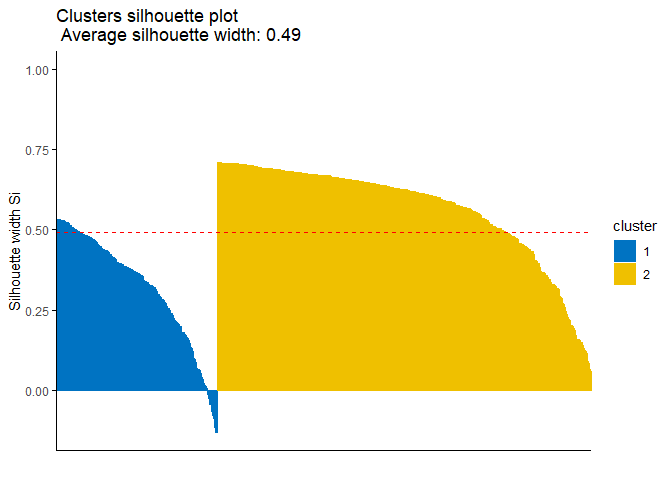<!-- -->

Grafikte mavi renkli olan 1. kümede görülebilen negatif siluet değerine
sahip gözlemler, yanlış kümelenmiş olabilecek gözlemlerdir. Bu durumda,
bu gözlemlerin indeks numaralarına ulaşmak ve onlarla ilgili sorunu
analiz etmek isteyebilirsiniz. Aşağıdaki kod, indeks numaralarını elde
etmenize yardımcı olabilir:

``` r
sil <- k2m_data$silinfo$widths[, 1:3] # silhouette değerlerinin bir nesneye kaydedilmesi
neg_sil_index <- which(sil[, 'sil_width']<0) # negatif silhouette değerine sahip gözlemlerin indeksine ulaşılması
sil[neg_sil_index, , drop = FALSE] # negatif silhouette değerine sahip gözlemlerin gösterilmesi
```

    ##     cluster neighbor   sil_width
    ## 505       1        2 -0.01334316
    ## 224       1        2 -0.02627560
    ## 198       1        2 -0.04503110
    ## 442       1        2 -0.04567814
    ## 197       1        2 -0.06567648
    ## 331       1        2 -0.07905193
    ## 90        1        2 -0.08708848
    ## 215       1        2 -0.11522042
    ## 12        1        2 -0.13105913
    ## 376       1        2 -0.13159631

## 7.5. Dunn Indeksi

CRI ve MVI gibi Dunn Endeksini de `fpc` paketindeki `cluster.stats`
fonksiyonu ile kolayca hesaplayabilirsiniz. Aşağıda Dunn Endeksi
hesaplamasına ilişkin kodu bulabilirsiniz.

``` r
cluster.stats(dist(df), k2m_data$cluster)$dunn
```

    ## [1] 0.005768501

**References for Chapter**

\[1\] Kassambara, Alboukadel. Practical guide to cluster analysis in R:
Unsupervised machine learning. Vol. 1. Sthda, 2017.

\[2\] Warrens, M. J., & van der Hoef, H. Understanding the rand index.
In Advanced Studies in Classification and Data Science (pp. 301-313).
Springer, Singapore. 2020

\[3\] Meilă M. “Comparing clusterings -an information based distance.”
J.Multivariate Analysis, 98(5), 873-895, 2007.

# 8. Temel Bileşen Analizi

Bir veri setindeki örüntüleri tanımlamak için kullanılan bir teknik olan
Temel Bileşen Analizi(TBA), verilerde en fazla varyasyonu açıklayan
yönleri (veya “bileşenleri”) arar. İlk bileşen, verideki en fazla
varyasyonu oluşturan yön, ikinci bileşen ise verideki ikinci en fazla
varyasyonu oluşturan yön olacak şekilde veriyi bileşenlerine ayırır
\[1\], \[2\]. Temel bileşen analizi özellikle büyük veya bir başka
deyişle çok değişkenli veri setlerinde faydalıdır ve sayesinde veri
setindeki karmaşık ilişkiler daha az değişken kullanılarak açıklığa
kavuşturulabilir. Bu da veri setinin daha kolay yorumlanabilmesini
sağlarken daha az değişken kullanımıyla da doğabilecek olası hatalı
sonuçların önlenmesini sağlar.

Daha önceki kısımlarda veri setini kümelemeden önce TBA uygulandığından
bahsedilmişti. Peki bu neden yapıldı? Bir veri setine kümeleme
algoritmalarına sokulmadan önce TBA uygulanmasının bazı faydaları
vardır. Örneğin Yoğunluk Bazlı Kümeleme kısmında algoritmanın yüksek
boyutlu veri setlerinde iyi sonuçlar vermediğinden bahsetmiştik. Diğer
algoritmalar bu konuda biraz daha başarılı olsalar da boyut yüksekliği
makine öğrenmesi ile ilgili neredeyse her algoritma için büyük bir
problemdir. TBA yüksek boyutlu bir veri setindeki değişken sayısını
azaltmak için kullanılabildiği için kümeleme algoritmasının
performansını artırmaya yardımcı olabilmektedir. Boyut azaltmaya ek
olarak, gürültüyü azaltmaya ve verilerdeki çoklu doğrusallığı ortadan
kaldırmaya da yardımcı olabilmesi sebebiyle hem kümeleme algoritmasının
başarısını arttırabilir, hem de yorumlanmasını
kolaylaştırabilir\[3\],\[4\].

Tüm bu faydaları bir örnekle pekiştirebiliriz. Ünlü Iris veri setini
hatırlayalım. Zambak çiçekleri ile ilgili çeşitli bilgileri içeren veri
setinde 3 farklı etiket bulunmaktadır. Aşağıda taç yaprağı ve çanak
yapraklarının dağılım grafiğini sol tarafta görürken; sağ kısımda ise
TBA uygulanmış Iris veri setinin dağılım grafiğini görebilirsiniz. TBA
uygulanmamış Iris veri setinde, yeşil ve kırmızı ile gösterilen iki
türün kesiştiğini fark edebilirsiniz. Aksine, TBA uygulanmış veri
setinde diğerine kıyasla bariz olmasa da daha ayrık olduğunu ve verideki
üç etiketin daha ayrıştırılabilir olduğunu gözlemleyebilirsiniz(Dağılım
grafiklerindeki gözlemlerin her bir rengi bir etiketi temsil
etmektedir).


Aşağıda birinci adımın opsiyonel olmasıyla birlikte TBA’nın adım adım
nasıl hesaplandığı bilgisine ulaşabilirsiniz:

**Adım 1**

Veriler, her değişkenin ortalaması sıfır ve standart sapması bir olacak
şekilde dönüştürülür. Bu, tüm değişkenlerin aynı ölçekte olmasını
sağlamak için yapılır.

**Adım 2**

Veri setindeki değişkenler arasındaki ilişkiyi belirlemek için kovaryans
matrisi hesaplanır.

**Adım 3**

Kovaryans matrisinin özvektörleri(eigenvector) ve
özdeğerleri(eigenvalue) hesaplanır. Özvektörler, verilerde en fazla
varyasyonu açıklayan yönleri temsil eder ve özdeğerler, her bir özvektör
tarafından açıklanan varyasyon miktarını temsil eder.

**Adım 4**

En yüksek özdeğerlere sahip özvektörler veri kümesinin temel bileşenleri
olarak seçilir.

**Adım 5**

Orijinal veri kümesi, temel bileşenlere yansıtılarak dönüştürülür ve
böylece boyutluluğu azaltılmış yeni bir veri kümesi elde edilir.

## 8.1. R’da Temel Bileşenler Analizi

Temel bileşen analizi `stats` paketinde yer alan `prcomp` adlı fonksiyon
ile aşağıdaki gibi yapılır:

``` r
data.pca <- prcomp(df, # TBA uygulanacak veri seti
                   scale. = TRUE # TBA hesaplamasındaki birinci adımın uygulanıp uygulanmayacağı
)
summary(data.pca) # sonuçları görmek için
```

    ## Importance of components:
    ##                           PC1    PC2     PC3    PC4     PC5     PC6     PC7
    ## Standard deviation     2.3406 1.5870 0.93841 0.7064 0.61036 0.35234 0.28299
    ## Proportion of Variance 0.5479 0.2519 0.08806 0.0499 0.03725 0.01241 0.00801
    ## Cumulative Proportion  0.5479 0.7997 0.88779 0.9377 0.97495 0.98736 0.99537
    ##                            PC8     PC9    PC10
    ## Standard deviation     0.18679 0.10552 0.01680
    ## Proportion of Variance 0.00349 0.00111 0.00003
    ## Cumulative Proportion  0.99886 0.99997 1.00000

Temel bileşen analizinden elde edilen sonuçları içeren bu çıktıda her
bir bileşen için standart sapma(standard deviation), varyans
oranı(proportion of variance) ve kümülatif oran(cumulative proportion)
değerleri bulunmaktadır. Bu değerlerden standart sapma, her bir
bileşenin varyansının kareköküdür. Bu değer, bileşenin veri setindeki
değişkenliği ne kadar iyi açıkladığını gösterir. Örneğin, PC1
bileşeninin standart sapması 2,3406’dır. Bu PC1’in veri setindeki
değişkenliğin çoğunluğunu açıkladığını gösterir. Varyans Oranı, her bir
bileşenin toplam varyans içindeki payını gösterir. Örneğin, PC1 bileşeni
veri setindeki varyansın %54,79’unu açıklarken PC2 bileşeni %25,19’unu
açıklamaktadır. Kümülatif Oran ise her bir bileşenin varyans oranının
toplamıdır. Bu değer, o bileşene kadar olan tüm bileşenlerin toplam
varyans içindeki payını gösterir. Örneğin, PC1 veri setindeki toplam
varyansın %54,79’unu açıklarken ilk iki bileşen veri setindeki varyansın
%79,97’sini açıklamaktadır.

Bu noktada analizi yapan kişi olarak dikket etmemiz gereken nokta veri
setini kaç bileşenle açıklamayı planladığımızdır. Bileşen sayısı veri
setinin büyüklüğüne ve analizin amacına bağlı olarak değişebilir. Ancak,
bileşenlerin kümülatif varyansının %70-80’ini açıklayacak kadar bileşen
seçmek yaygındır. Bu örnekte, ilk iki bileşen toplam varyansın
%79,97’sini açıkladığı için iki bileşen seçmek iyi bir başlangıç noktası
olabilir.

Bileşen sayısına karar vermenin bir diğer yolu da Scree grafiğidir.
Scree grafiği, her bir boyut için açıklanan varyans yüzdesinin
çizilmesiyle oluşturulur. Tıpkı dirsek yönteminde olduğu gibi, Scree
grafiğinde de bir dirsek aranır. Dirseğin oluştuğu bileşen en uygun
bileşen sayısı olarak seçilir. `factoextra` paketinden `fviz_eig`
fonksiyonu yardımıyla Scree grafiğini çizebiliriz:

``` r
library(factoextra)
fviz_eig(data.pca)
```

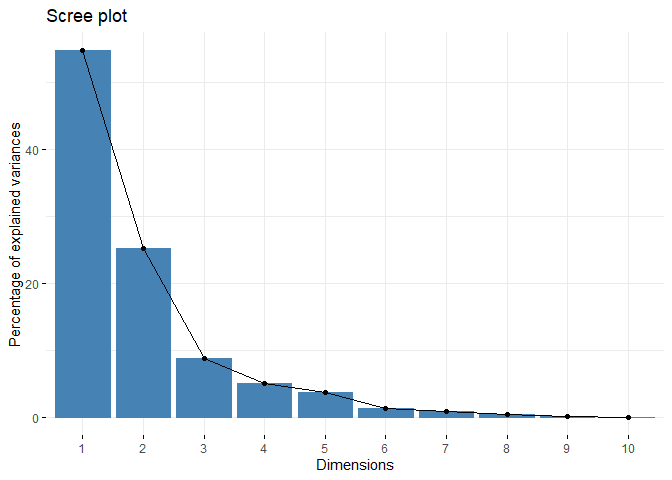<!-- -->

Scree grafiği incelendiğinde, dirseğin üçüncü bileşende göründüğünü fark
ederiz. Bu özet çıktıda vardığımız sonuçla çelişiyor. Bu da bir analiz
yapılması gerektiğini işaret ediyor -ki bu da TBA’nın açıklandığı bir
kitap için veri setini mükemmel bir örnek haline getiriyor. Şimdi
TBA’nın derinliklerine inelim.

`summary` fonksiyonu ile özetini çıkarttığımız TBA sonuçlarını içeren
`data.pca` nesnesi birçok farklı bilgiyi de içerisinde saklamaktadır. Bu
bilgilerden biri de rotasyon özelliğidir. Rotasyon özelliği,
bileşenlerin orijinal değişkenlerle olan ilişkisini gösterir. Örneğin,
bileşen 3’ün rotasyon özelliği, orijinal değişkenlerin her biri ile
bileşen 3 arasındaki ilişkiyi gösteren bir vektördür. Bu vektör,
orijinal değişkenlerin temel bileşenlerle ilişkisini anlamamıza yardımcı
olur. Bu örnekte 2 ve 3 bileşen arasında kaldığımız için ilk üç
bileşenin rotasyon değerlerine bakmak faydalı olabilir. `data.pca`
nesnesi üzerindeki “rotation” özelliğine erişmek için
`data.pca$rotation` komutunu kullanabiliriz.

``` r
data.pca$rotation[,1:3]
```

    ##                           PC1          PC2         PC3
    ## radius            -0.36393793  0.313929073 -0.12442759
    ## texture           -0.15445113  0.147180909  0.95105659
    ## perimeter         -0.37604434  0.284657885 -0.11408360
    ## area              -0.36408585  0.304841714 -0.12337786
    ## smoothness        -0.23248053 -0.401962324 -0.16653247
    ## compactness       -0.36444206 -0.266013147  0.05827786
    ## concavity         -0.39574849 -0.104285968  0.04114649
    ## concave.points    -0.41803840 -0.007183605 -0.06855383
    ## symmetry          -0.21523797 -0.368300910  0.03672364
    ## fractal.dimension -0.07183744 -0.571767700  0.11358395

Yukarıdaki çıktıda, her sütun temel bileşenin orijinal değişkenlerle
ilişkisini gösteren bir vektör içerir. Örneğin, PC1 sütunu her bir
orijinal değişkenin PC1 ile ilişkisini gösteren bir vektördür. Bu
ilişki, her bir orijinal değişkenin temel bileşenlere ne kadar katkıda
bulunduğunu gösterir. Örneğin, PC1 sütununda bütün değişkenlerin negatif
katkısı daha yüksektir. PC3 bileşenine ve bu bileşene katkıda bulunan
değişkenlere bakıldığında, sadece “texture” değişkeninin bileşene
katkıda bulunduğunu bu sayede fark edebiliriz. Tek bir değişken için
bileşen eklemek çok maliyetli ve mantıksız olacağından, bu veri setinde
iki temel bileşen seçmenin daha uygun olacağını düşünebiliriz.

Bileşenler ve değişkenleri teker teker incelemek yorucu bir işlem
olabileceği için rotasyonların grafiğini çizdirmek bizim için daha
faydalı olabilir. `factoextra` paketindeki `fviz_contrib` fonksiyonu ile
her bir bileşen için değişkenlerin katkısının grafiğini çizebiliriz:

``` r
fviz_contrib(data.pca,# TBA nesnesi
             choice = "var", # değişken için "var" , gözlem katkısına bakmak için "ind" 
             axes = 1 # 1. Bileşen için 1
)
```

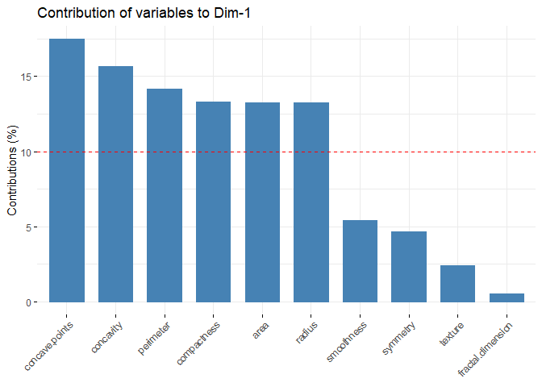<!-- -->

``` r
fviz_contrib(data.pca,# TBA nesnesi
             choice = "var", # değişken için "var" , gözlem katkısına bakmak için "ind" 
             axes = 2 # 2. Bileşen için 2
)
```

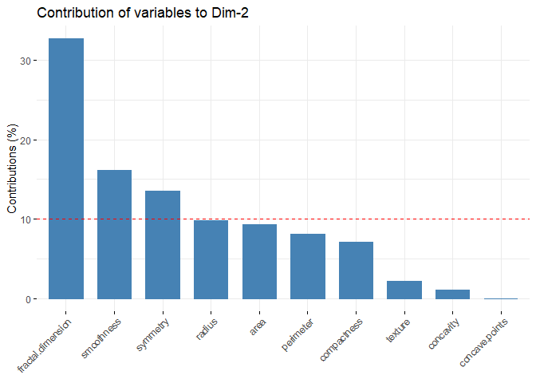<!-- -->

``` r
fviz_contrib(data.pca,# TBA nesnesi
             choice = "var", # değişken için "var" , gözlem katkısına bakmak için "ind" 
             axes = 3 # 3. Bileşen için 3
)
```

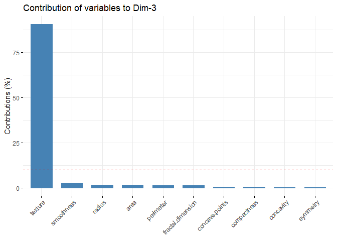<!-- -->

`factoextra` paketi içerisinde yer alan `fviz_pca_ind` fonksiyonu ile
veri setindeki her bir gözlemin bileşenlere katkısı
görselleştirilebilmektedir:

``` r
fviz_pca_ind(data.pca,# TBA nesnesi
             col.ind = "cos2",  # gözlemler için renkler, temsil nitelikleri ("cos2") tarafından otomatik olarak kontrol edilir,
             gradient.cols = c("#00AFBB", "#E7B800", "#FC4E07"), # n-renk geçiş için kullanılacak renklerin vektörü.
             repel = F #  Metin etiketlerinin fazla çizilmesini önlemek için ggrepel kullanılıp kullanılmayacağı.   
)
```

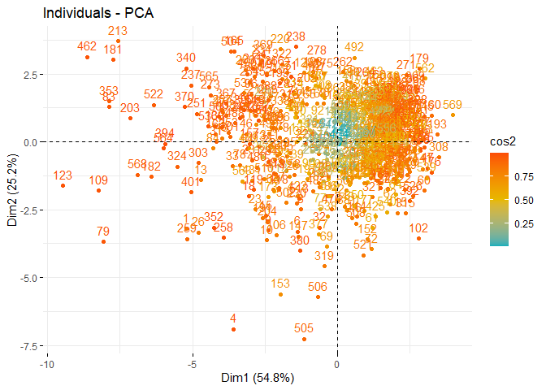<!-- -->

PC1 ve PC2 boyutlarındaki gözlemlerin katkıları incelendiğinde sağ üst
ve sağ altta bir kümelenme gözlenmektedir. Bu gözlemlerin benzer
özellikler ifade ettiği söylenebilir. Örneğin sol alttaki 79. gözlemin
değerleri incelendiğinde Radius ve Texture dışındaki tüm değişkenler
için maksimuma yakın değerlere sahip olduğu görülebilir. Karşı eksendeki
569. gözlem değerleri incelendiğinde ise Smoothness ve Concavity’nin
minimum değerlere sahip olduğu, Texture’ın ise 3. çeyreğin üzerinde bir
değere sahip olduğu görülebilir.

**References for Chapter**

\[1\] Bryant, F. B., & Yarnold, P. R. (1995). Principal-components
analysis and exploratory and confirmatory factor analysis.

\[2\] James, G., Witten, D., Hastie, T., & Tibshirani, R. (2013). An
introduction to statistical learning (Vol. 112, p. 18). New York:
springer.

\[3\] Ben-Hur, Asa, and Isabelle Guyon. Detecting stable clusters using
principal component analysis. Functional genomics. Humana press,
159–182, 2003.

\[4\] Ding, Chris, and Xiaofeng He. K-means clustering via principal
component analysis. Proceedings of the twenty-first international
conference on Machine learning. 2004.

# Alıştırmalar

Alıştırmalar için öncelikle [Breast
Tissue](http://archive.ics.uci.edu/ml/datasets/breast+tissue) veri
setini indirmeniz gerekmektedir. Veri seti, göğüs doku örneklerinin
elektriksel empedans ölçümlerinden oluşmaktadır. 106 gözlem ve 10
değişken bulunmaktadır. Ancak Class isimli bir değişken sınıflandırma
projeleri için etiket bilgisi ile ilgilidir. Veri setini kümeleyeceğiniz
için bu değişken veri setinden çıkarılmalıdır. Ancak kümeleme
sonuçlarının geçerliliğini değerlendirmek için bu değişkeni kullanmanız
gerekebilir. Değişkenler hakkında detaylı bilgi [UCI Machine Learning
Repository
website](http://archive.ics.uci.edu/ml/datasets/breast+tissue) adresinde
yer almaktadır. Alıştırmalar kısmı için aşağıdaki adımları tamamlamanız
gerekmektedir:

1.  Veri setinin tanımlayıcı istatistiklerini analiz edin ve yorumlayın.

2.  Veri setinin korelasyonunu analiz edin.

3.  Veri setine Temel Bileşen Analizi uygulayınız.

4.  Veri setine k-ortalamalar uygulayın.

5.  Veri setine k-medoidleri uygulayın.

6.  Veri kümesine hiyerarşik kümeleme uygulayın.

7.  Veri setine yoğunluk bazlı kümeleme uygulayın.

8.  Tüm kümeleme algoritmaları için küme geçerliliği metriklerini
    karşılaştırın ve en iyi algoritmaya karar verin.

9.  En iyi algoritma sonucu oluşan kümeleri birbiri ile kıyaslayıp
    analiz edin.
